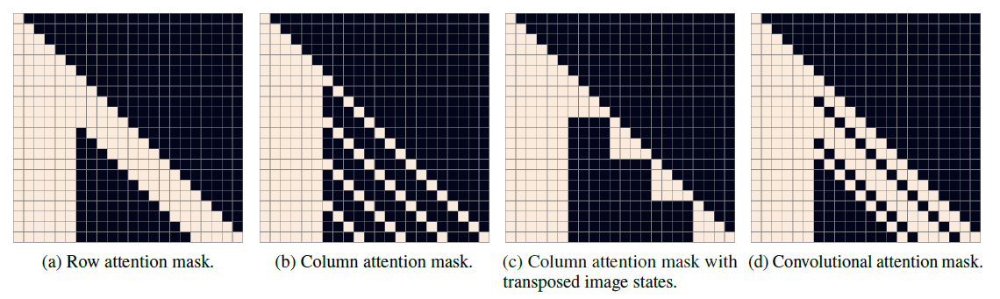

# CLIP && DALL-E

## CLIP

### 1、动机

虽然深度学习在CV领域很成功，但是：

- typical vision datasets are labor intensive and costly to create while teaching only a narrow set of [visual concepts](https://www.zhihu.com/search?q=visual+concepts&search_source=Entity&hybrid_search_source=Entity&hybrid_search_extra={"sourceType"%3A"answer"%2C"sourceId"%3A1669790824})（当前的CV数据集标注劳动密集，成本高昂；）
-  standard vision models are good at one task and one task only, and require significant effort to adapt to a new task; （模型在单一任务上优秀，但难迁移到新任务）
- and models that perform well on benchmarks have disappointingly poor performance on stress tests, casting doubt on the entire deep learning approach to computer vision.（泛化性和[鲁棒性](https://www.zhihu.com/search?q=鲁棒性&search_source=Entity&hybrid_search_source=Entity&hybrid_search_extra={"sourceType"%3A"answer"%2C"sourceId"%3A1669790824})堪忧）

### 2、CLIP解决方案概述

a、互联网上较容易搜集到大量成对的文本和图像，对于任何一个图像文本对而言，文本其实可以认为是图像的标签。也就是说，互联网上天然就存在已经标注好的CV数据集，这解决了“动机”中的问题a。

b、而互联网上存在的这些已经标注好的CV数据集数量不仅大而且差异也大，当我们在这样的数据集上训练一个表达能力足够强的模型时，这个模型就能具备较强的泛化能力，较容易迁移到其他新任务上，这缓解了“动机”中的问题b和问题c。

上述两段话是CLIP解决方案的粗线条概括。

OpenAI的这项新工作CLIP可以解决上述问题，思路看起来很简单，看下图就知道了，简单来说CLIP是将Text Decoder从文本中提取的语义特征和Image Decoder从图像中提取的语义特征进行匹配训练：

### 3、CLIP细节

“CLIP的[解决方案概述](https://www.zhihu.com/search?q=解决方案概述&search_source=Entity&hybrid_search_source=Entity&hybrid_search_extra={"sourceType"%3A"answer"%2C"sourceId"%3A1678007012})”中的a比较容易解决：

- 确定一系列query，然后通过搜索引擎（通用搜索引擎如Google等，或者垂直领域搜索引擎Twitter等）搜索图片。

- 最后通过50万条query，搜索得到4亿个图像文本对，这样一个大规模的数据量，对应了“CLIP的解决方案概述”中的b。

既然我们有了图像文本对，那么最直接训练方法就是[metric learning](https://www.zhihu.com/search?q=metric+learning&search_source=Entity&hybrid_search_source=Entity&hybrid_search_extra={"sourceType"%3A"answer"%2C"sourceId"%3A1678007012})，CLIP的确也是这么干的。

### 4、一些思考

**NLP supervision如何理解。**

[NLP supervision](https://www.zhihu.com/search?q=NLP+supervision&search_source=Entity&hybrid_search_source=Entity&hybrid_search_extra={"sourceType"%3A"answer"%2C"sourceId"%3A1678007012})其实可以理解为**多维度**的标签，常见的分类任务只有**一维**，比如ImageNet-1K是一维，这一维的shape为1000，而NLP supervision可以认为是多维，比如[三维](https://www.zhihu.com/search?q=三维&search_source=Entity&hybrid_search_source=Entity&hybrid_search_extra={"sourceType"%3A"answer"%2C"sourceId"%3A1678007012})，shape为(A, B, C)，每一维描述一个concept。

经典图像分类的一维标签只包含一种数据集创建者自己设定的较粗的单种concept，比如ImageNet-1K里的“图像包含[egyptian cat](https://www.zhihu.com/search?q=egyptian+cat&search_source=Entity&hybrid_search_source=Entity&hybrid_search_extra={"sourceType"%3A"answer"%2C"sourceId"%3A1678007012})、Persian cat、[tiger cat](https://www.zhihu.com/search?q=tiger+cat&search_source=Entity&hybrid_search_source=Entity&hybrid_search_extra={"sourceType"%3A"answer"%2C"sourceId"%3A1678007012})、alley cat等1000种类别中的哪一种”。

而这个单种concept可以由多种concept组合而来，一方面可以减小歧义，一方面方便迁移，比如颜色、大小等等，NLP supervision就可以达到类似的一种效果，比如“a photo of guacamole, a type of food”这一句话告诉我们这是一张图片，图片里包含的是食物，这个食物是酸橘汁腌鱼。

**zero shot如何理解**

我们通过CLIP训练出来一个模型之后，满足以下条件的新任务都可以直接[zero shot](https://www.zhihu.com/search?q=zero+shot&search_source=Entity&hybrid_search_source=Entity&hybrid_search_extra={"sourceType"%3A"answer"%2C"sourceId"%3A1678007012})进行识别：

1、我们能够用文字描述清楚这个新分类任务中每个类别；

2、这个描述对应的概念在CLIP的训练集中出现过。这在经典[一维标签](https://www.zhihu.com/search?q=一维标签&search_source=Entity&hybrid_search_source=Entity&hybrid_search_extra={"sourceType"%3A"answer"%2C"sourceId"%3A1678007012})的图像分类中是不可实现的。

CLIP这种方法把分类转换为了**跨模态检索**，模型足够强的情况下，检索会比分类扩展性强。比如人脸识别，如果我们把人脸识别建模为分类任务，当gallery里新增加人脸后，类别数就变大了，我们就需要重新训练模型、更新类别数；如果我们将人脸识别建模为检索，当gallery里新增加人脸后，我们用已有的模型提取这个人脸的特征，后续流程不用变，也不用重新训练模型。

从检索这个角度来看，CLIP的zero shot其实就是把分类问题转化为了检索问题。

总结来看，CLIP能够zero shot识别，而且效果不错的原因在于：

1、训练集够大，zero shot任务的图像分布在训练集中有类似的，zero shot任务的concept在训练集中有相近的；

2、将分类问题转换为检索问题。

**concept的唬人之处**

CLIP这篇文章里提到通过NLP supervision能够让模型学到concept的概念，concept这个比较唬人，实际情况可能比我们想象的要差一些。

OpenAI没放数据集，我们只知道有50万query，但是这些query是怎么样的我们不得而知，比如是很简单的描述还是较复杂的描述。如果只是简单的描述，比如“black cat”、“lecture room”之类，那NLP encoder学到的所谓concept可能比较低级，稍微比[bag of words](https://www.zhihu.com/search?q=bag+of+words&search_source=Entity&hybrid_search_source=Entity&hybrid_search_extra={"sourceType"%3A"answer"%2C"sourceId"%3A1678007012})好一点，毕竟50万的量不是很大，query又简单。

我猜想情况可能近乎于如此，论据如下：

1、原文里作者说到“we found CLIP's performance to be less sensitive to the capacity of the text encoder”；

2、zero shot时，[prompt engineering](https://www.zhihu.com/search?q=prompt+engineering&search_source=Entity&hybrid_search_source=Entity&hybrid_search_extra={"sourceType"%3A"answer"%2C"sourceId"%3A1678007012})和prompt ensemble影响较大，原文里说到“When considered together, prompt engineering and ensembling improve ImageNet accuracy by almost 5%”。

**数据问题**

一个强大的方法不仅需要依赖强大的[模型结构](https://www.zhihu.com/search?q=模型结构&search_source=Entity&hybrid_search_source=Entity&hybrid_search_extra={"sourceType"%3A"answer"%2C"sourceId"%3A1678007012})，还仰仗大规模的训练集。模型结构决定下限，数据集决定上限。CLIP这种方法的上限如何，query的数量和质量至关重要。

如果图像文本对仅仅通过搜索的方式在互联网上获取，感觉文本不太可能复杂，这个会限制CLIP的上限。如果能找到一种获取大量图像文本对，而且文本还比较复杂，那么CLIP这种方法前景会非常不错。

**相比于传统图像分类方法的优势。**

这是显而易见的：每张图像的标签不再是一个名词，而是一个句子，因此以往被强行分成同类的图像，就有了“无限细粒度”的标签。例如ImageNet给图片打的标签是“[金毛寻回犬](https://www.zhihu.com/search?q=金毛寻回犬&search_source=Entity&hybrid_search_source=Entity&hybrid_search_extra={"sourceType"%3A"answer"%2C"sourceId"%3A"1670115915"})”，而这种配对的例子，就可以学习“金毛寻回犬”身处不同环境、在做不同事情的细微差别。

**相比于传统图像分类方法的劣势。**

主要还是文本和图像的配对关联性不够强。这是为什么作者反复强调要收集巨大的数据集，因为他们必须通过大数据的方式来压制[噪声](https://www.zhihu.com/search?q=噪声&search_source=Entity&hybrid_search_source=Entity&hybrid_search_extra={"sourceType"%3A"answer"%2C"sourceId"%3A"1670115915"})。从这个观点出发，我们可以看出些许未来的趋势（见下面第2和第3点）。

#### 图像和文本之间的交互方式。

直接用文本的encoding结果做为图像的监督信号，显然噪声太大了；能否借鉴captioning等方向的做法，允许图像和文本在encoding过程中多次交互，从而提升效果？当然，这里还是涉及到语言模型太大，无法高效训练。不过，OpenAI也可以选择暴力出奇迹，直接从头训练大规模的跨模态预训练模型。只是这样做的话，400M的数据集可能就太小了。

## DALL-E

DALL-E官方论文代码终于放出，OpenAI是如何实现图像版GPT-3的?

图1 DALL-E的整体架构

今年1月份openAI发布了DALL-E模型，能够根据文本生成效果惊艳的图像，并且参数量达到了120亿，被称为“图像版GPT-3”。

最近，openAI放出了DALL-E的论文和部分代码，使得大家能够进一步一窥究竟。根据本次开出的论文《[Zero-Shot Text-to-Image Generation](https://www.zhihu.com/search?q=Zero-Shot+Text-to-Image+Generation&search_source=Entity&hybrid_search_source=Entity&hybrid_search_extra={"sourceType"%3A"answer"%2C"sourceId"%3A"1764970196"})》**[1]**，简单整理了一下DALL-E的整体架构，如图1所示，DALL-E的推理主要分为三个阶段，其中前两个阶段对应论文中的Stage One和Stage Two。

在第一个阶段，将256×256的图片分为32×32个patch，然后使用训练好的[离散VAE模型](https://www.zhihu.com/search?q=离散VAE模型&search_source=Entity&hybrid_search_source=Entity&hybrid_search_extra={"sourceType"%3A"answer"%2C"sourceId"%3A"1764970196"})的encoder将每个patch映射到大小为8192的词表中，最终一张图片转为用1024个token表示。在第二个阶段，使用[BPE-encoder](https://www.zhihu.com/search?q=BPE-encoder&search_source=Entity&hybrid_search_source=Entity&hybrid_search_extra={"sourceType"%3A"answer"%2C"sourceId"%3A"1764970196"})对文本进行编码，得到最多256个token，token数不满256的话padding到256；再将256个文本token与1024个图像token进行拼接，得到长度为1280的数据；最终将拼接的数据输入训练好的具有120亿参数的[Transformer模型](https://www.zhihu.com/search?q=Transformer模型&search_source=Entity&hybrid_search_source=Entity&hybrid_search_extra={"sourceType"%3A"answer"%2C"sourceId"%3A"1764970196"})。在第三个阶段，对模型生成的图像进行采样，并使用同期发布的CLIP模型**[2]**对采样结果进行排序，从而得到与文本最匹配的生成图像。

DALLE包括三个独立训练得到的模型：dVAE，Transformer和CLIP，其中dVAE的训练与VAE基本相同，Transformer采用类似GPT-3的生成式预训练方法。下面对DALL-E采用的dVAE模型和Transformer模型做简单介绍，对CLIP感兴趣的朋友可以参考**[2]**。

- **dVAE**

dVAE主要用来为图像的每个patch生成token表示，这次openAI开出的代码就是dVAE的推理代码。dVAE的encoder和decoder的机构较为简单，都是由bottleneck-style的resblock组成，但与常见的VAE相比，dVAE有以下两点区别：

1、dVAE的encoder是将图像的patch映射到8192的词表中，论文中将其分布设为

在词表向量上的[均匀分类分布](https://www.zhihu.com/search?q=均匀分类分布&search_source=Entity&hybrid_search_source=Entity&hybrid_search_extra={"sourceType"%3A"answer"%2C"sourceId"%3A"1764970196"})，这是一个离散分布，由于不可导的问题，此时不能采用重参数技巧。DALL-E使用了[Gumbel-SoftMax trick](https://www.zhihu.com/search?q=Gumbel-SoftMax+trick&search_source=Entity&hybrid_search_source=Entity&hybrid_search_extra={"sourceType"%3A"answer"%2C"sourceId"%3A"1764970196"})来解决这个问题，对Gumbel-SoftMax trick感兴趣的朋友可以参考**[3]**。

2、在重建图像时，真实的像素值是在一个[有界区间](https://www.zhihu.com/search?q=有界区间&search_source=Entity&hybrid_search_source=Entity&hybrid_search_extra={"sourceType"%3A"answer"%2C"sourceId"%3A"1764970196"})内，而VAE中使用的Gaussian

分布和Laplace分布都是在整个实数集上，这造成了不匹配的问题。为了解决这个问题，论文中提出了logit-Laplace分布，如下式所示：

- **Transformer**

Dall-E中的Transformer结构由64层attention层组成，每层的注意力头数为62，每个注意力头的维度为64，因此，每个token的向量表示维度为3968。如图2所示，attention层使用了行注意力mask、列注意力mask和[卷积注意力mask](https://www.zhihu.com/search?q=卷积注意力mask&search_source=Entity&hybrid_search_source=Entity&hybrid_search_extra={"sourceType"%3A"answer"%2C"sourceId"%3A"1764970196"})三种稀疏注意力。

图2 Transformer使用的3种稀疏注意力

Transformer的输入如图3所示，其中[pad embd](https://www.zhihu.com/search?q=pad+embd&search_source=Entity&hybrid_search_source=Entity&hybrid_search_extra={"sourceType"%3A"answer"%2C"sourceId"%3A"1764970196"})通过学习得到，根据论文介绍，为每个位置都训练了一个pad embd，即256个pad embd，在对文本token进行pad时，使用对应位置的pad embd。

图3 Transformer输入示意图（假设文本最大长度6)

总的来说，目前公开的DALL-E的实现在模型结构上并没有太多创新，而是合理利用了现有的模型结构进行组合，并采用了一些trick解决了遇到的问题，从而在大数据集上训练得到超大规模的模型，取得了令人惊艳的效果，这也符合openAI的一贯风格。但无论如何，DALL-E在[深度学习](https://www.zhihu.com/search?q=深度学习&search_source=Entity&hybrid_search_source=Entity&hybrid_search_extra={"sourceType"%3A"answer"%2C"sourceId"%3A"1764970196"})能力边界探索的道路上又前进了一步，也再一次展示了大数据和超大规模模型的魅力。美中不足的是，DALL-E包含了三个模块，更像是一个pipeline，而对于普通的研究者来说，要运行这样一个复杂的大规模模型是一件很困难的事情。
