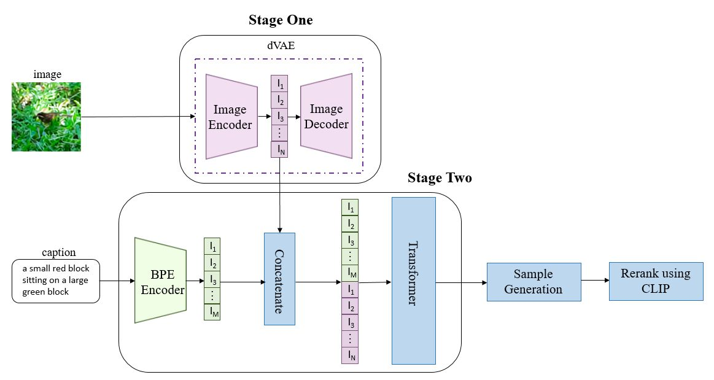
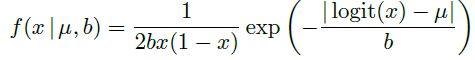
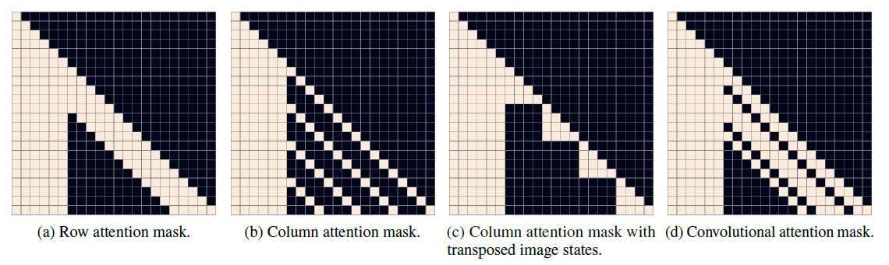
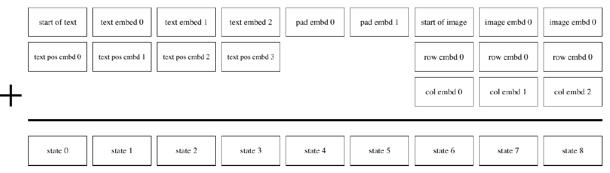

<!--
 * @Author: jianzhnie
 * @Date: 2021-12-06 09:43:59
 * @LastEditTime: 2021-12-06 09:44:16
 * @LastEditors: jianzhnie
 * @Description:
 *
-->

# DALL-E

今年1月份openAI发布了DALL-E模型，能够根据文本生成效果惊艳的图像，并且参数量达到了120亿，被称为“图像版GPT-3”。

最近，openAI放出了DALL-E的论文和部分代码，使得大家能够进一步一窥究竟。根据本次开出的论文《[Zero-Shot Text-to-Image Generation]()，简单整理了一下DALL-E的整体架构，如图1所示，DALL-E的推理主要分为三个阶段，其中前两个阶段对应论文中的Stage One和 Stage Two。

​																	图1 DALL-E的整体架构

- 第一个阶段，将256×256的图片分为32×32个patch，然后使用训练好的[离散VAE模型]()的encoder将每个patch映射到大小为8192的词表中，最终一张图片转为用1024个token表示。
- 在第二个阶段，使用[BPE-encoder]()对文本进行编码，得到最多256个token，token数不满256的话padding到256；再将256个文本token与1024个图像token进行拼接，得到长度为1280的数据；最终将拼接的数据输入训练好的具有120亿参数的[Transformer模型]()。
- 在第三个阶段，对模型生成的图像进行采样，并使用同期发布的CLIP模型对采样结果进行排序，从而得到与文本最匹配的生成图像。

DALLE采样生成512个图片会用CLIP模型做rerank，CLIP给了论文和模型forward的代码，具体来说是在网上收集了4亿的图文对，然后在超大batch内做基于图文表征的对比学习。

DALLE包括三个独立训练得到的模型：dVAE，Transformer和CLIP，其中dVAE的训练与VAE基本相同，Transformer采用类似GPT-3的生成式预训练方法。下面对DALL-E采用的dVAE模型和Transformer模型做简单介绍，对CLIP感兴趣的朋友可以参考。

- **dVAE**

dVAE主要用来为图像的每个patch生成token表示，这次openAI开出的代码就是dVAE的推理代码。dVAE的encoder和decoder的机构较为简单，都是由bottleneck-style的res-block组成，但与常见的VAE相比，dVAE有以下两点区别：

1、dVAE的encoder是将图像的patch映射到8192的词表中，论文中将其分布设为

在词表向量上的[均匀分类分布]()，这是一个离散分布，由于不可导的问题，此时不能采用重参数技巧。DALL-E使用了[Gumbel-SoftMax trick]()来解决这个问题，对Gumbel-SoftMax trick感兴趣的朋友可以参考。

2、在重建图像时，真实的像素值是在一个[有界区间]()内，而VAE中使用的Gaussian

分布和Laplace分布都是在整个实数集上，这造成了不匹配的问题。为了解决这个问题，论文中提出了logit-Laplace分布，如下式所示：

- **Transformer**

Dall-E中的Transformer结构由64层attention层组成，每层的注意力头数为62，每个注意力头的维度为64，因此，每个token的向量表示维度为3968。如图2所示，attention层使用了行注意力mask、列注意力mask和[卷积注意力mask]()三种稀疏注意力。

																							图2 Transformer使用的3种稀疏注意力

Transformer的输入如图3所示，其中[pad embd]()通过学习得到，根据论文介绍，为每个位置都训练了一个pad embd，即256个pad embd，在对文本token进行pad时，使用对应位置的pad embd。

																				图3 Transformer输入示意图（假设文本最大长度6)

总的来说，目前公开的DALL-E的实现在模型结构上并没有太多创新，而是合理利用了现有的模型结构进行组合，并采用了一些trick解决了遇到的问题，从而在大数据集上训练得到超大规模的模型，取得了令人惊艳的效果，这也符合openAI的一贯风格。但无论如何，DALL-E在[深度学习](https://www.zhihu.com/search?q=深度学习&search_source=Entity&hybrid_search_source=Entity&hybrid_search_extra={"sourceType"%3A"answer"%2C"sourceId"%3A"1764970196"})能力边界探索的道路上又前进了一步，也再一次展示了大数据和超大规模模型的魅力。美中不足的是，DALL-E包含了三个模块，更像是一个pipeline，而对于普通的研究者来说，要运行这样一个复杂的大规模模型是一件很困难的事情。
