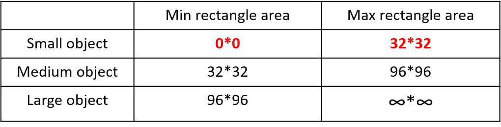
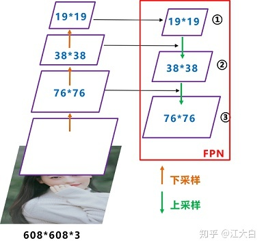
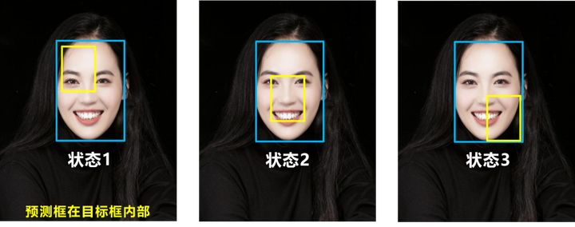
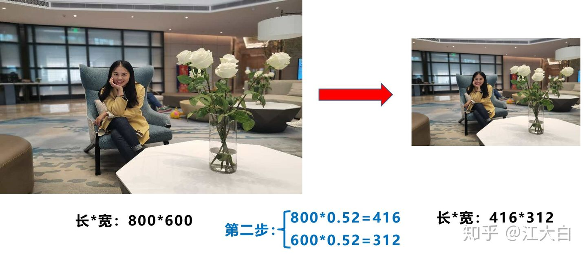
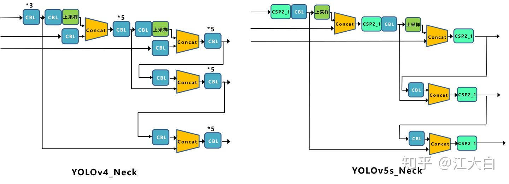
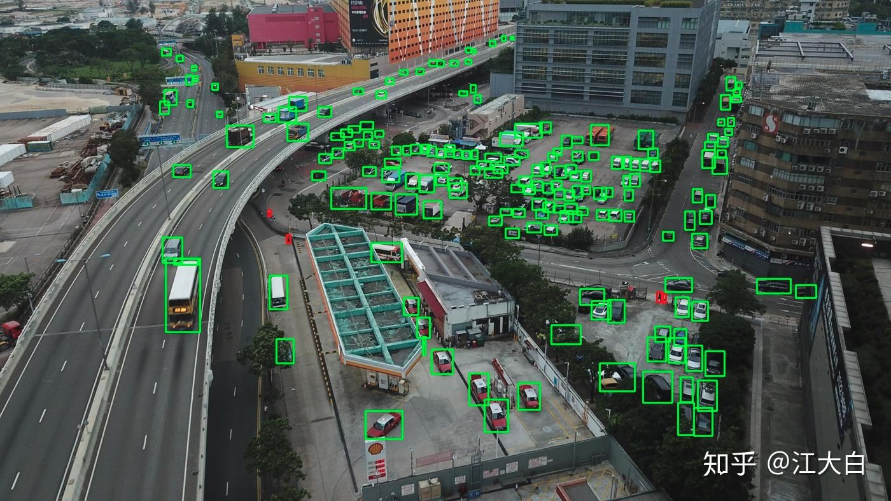
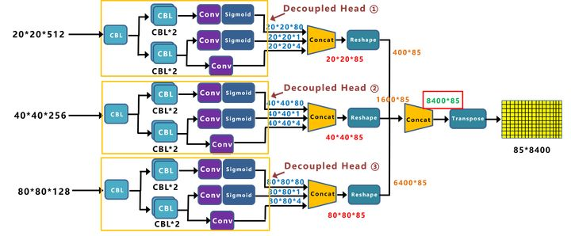
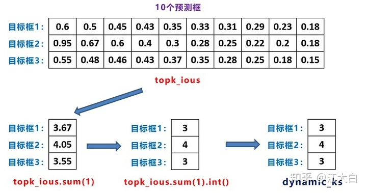

[toc]

# Yolov3

## 网络结构图

**上图三个蓝色方框内表示Yolov3的三个基本组件**：

1. **CBL：**Yolov3网络结构中的最小组件，由**Conv+Bn+Leaky_relu**激活函数三者组成。
2. **Res unit：**借鉴**Resnet**网络中的残差结构，让网络可以构建的更深。
3. **ResX：**由一个**CBL**和**X**个残差组件构成，是Yolov3中的大组件。每个Res模块前面的 CBL 都起到下采样的作用，因此经过5次Res模块后，得到的[特征图](https://www.zhihu.com/search?q=特征图&search_source=Entity&hybrid_search_source=Entity&hybrid_search_extra={"sourceType"%3A"article"%2C"sourceId"%3A"143747206"})是**608->304->152->76->38->19大小**。

**其他基础操作：**

1. **Concat：**张量拼接，会扩充两个张量的维度，例如26x26x*256和26*x26x*512两个张量拼接，结果是26*x26x768。Concat和cfg文件中的route功能一样。
2. **add：**张量相加，张量直接相加，不会扩充维度，例如104x104x*128和104*x104x128相加，结果还是104x104x128。add和cfg文件中的shortcut功能一样。

**Backbone中卷积层的数量：**

每个ResX中包含1+2*X个卷积层，因此整个主干网络Backbone中一共包含**1+（1+2\*1）+（1+2\*2）+（1+2\*8）+（1+2\*8）+（1+2\*4）=52**，再加上一个FC全连接层，即可以组成一个**Darknet53分类网络**。不过在目标检测Yolov3中，去掉FC层，不过为了方便称呼，仍然把**Yolov3**的主干网络叫做**Darknet53结构**。

## 网络结构解析：

1. Yolov3 中，只有卷积层，通过**调节卷积步长控制输出特征图的尺寸**。所以对于输入图片尺寸没有特别限制。流程图中，输入图片以256*256作为样例。
2. Yolov3 借鉴了**金字塔特征图**思想，**小尺寸特征图用于检测大尺寸物体**，而**大尺寸特征图检测小尺寸物体**。
3. Yolov3 总共输出3个特征图，第一个特征图下采样32倍，第二个特征图下采样16倍，第三个下采样8倍。输入图像经过Darknet-53（无全连接层），再经过Yoloblock生成的特征图被当作两用，第一用为经过3X*3卷积层、1*x1卷积之后生成特征图一，第二用为经过1x1卷积层加上采样层，与Darnet-53网络的中间层输出结果进行拼接，产生特征图二。同样的循环之后产生特征图三。
4. concat 操作与加和操作的区别：加和操作来源于ResNet思想，将输入的特征图，与输出特征图对应维度进行相加，而concat操作源于DenseNet网络的设计思路，将特征图按照通道维度直接进行拼接，例如8x*8x16的特征图与8x8x*16的特征图拼接后生成8x*8x32的特征图。
5. 上采样层(upsample)：作用是将小尺寸特征图通过插值等方法，生成大尺寸图像。例如使用最近邻插值算法，将8x*8的图像变换为16*x16。上采样层不改变特征图的通道数。

Yolo的整个网络，吸取了Resnet、Densenet、FPN的精髓，可以说是融合了目标检测当前业界最有效的全部技巧。

## 网络前向

根据不同的输入尺寸，会得到不同大小的输出特征图，以图二中输入图片256 × 256 × 3为例，输出的特征图为8 × 8 × 255、16 × 16 × 255、32 × 32 × 255。在Yolov3的设计中，每个特征图的每个格子中，都配置3个不同的先验框，所以最后三个特征图，这里暂且reshape为8 × 8 × 3 × 85、16 × 16 × 3 × 85、32 × 32 × 3 × 85，这样更容易理解，在代码中也是reshape成这样之后更容易操作。

三张特征图就是整个Yolo输出的检测结果，检测框位置（4维）、检测置信度（1维）、类别（80维）都在其中，加起来正好是85维。特征图最后的维度85，代表的就是这些信息，而特征图其他维度N × N × 3，N × N代表了检测框的参考位置信息，3是3个不同尺度的先验框。下面详细描述怎么将检测信息解码出来：

#### 先验框

- 在Yolov1中，网络直接回归检测框的宽、高，这样效果有限。

- 在Yolov2中，改为了回归基于先验框的变化值，这样网络的学习难度降低，整体精度提升不小。
- Yolov3沿用了Yolov2中关于先验框的技巧，并且使用 k-means 对数据集中的标签框进行聚类，得到类别中心点的9个框，作为先验框。在COCO数据集中（原始图片全部resize为416 × 416），九个框分别是 (10×13)，(16×30)，(33×23)，(30×61)，(62×45)，(59× 119)， (116 × 90)， (156 × 198)，(373 × 326) ，顺序为w × h。

注：先验框只与检测框的w、h有关，与x、y无关。

#### 检测框解码

有了先验框与输出特征图，就可以解码检测框 x，y，w，h。

#### 测置信度解码

物体的检测置信度，在Yolo设计中非常重要，关系到算法的检测正确率与召回率。

置信度在输出85维中占固定一位，由sigmoid函数解码即可，解码之后数值区间在[0，1]中。

#### 类别解码

COCO数据集有80个类别，所以类别数在85维输出中占了80维，每一维独立代表一个类别的置信度。

使用sigmoid激活函数替代了Yolov2中的softmax，取消了类别之间的互斥，可以使网络更加灵活。

三个特征图一共可以解码出 8 × 8 × 3 + 16 × 16 × 3 + 32 × 32 × 3 = 4032 个box以及相应的类别、置信度。这4032个box，在训练和推理时，使用方法不一样：

1. 训练时4032个box全部送入打标签函数，进行后一步的标签以及损失函数的计算。
2. 推理时，选取一个置信度阈值，过滤掉低阈值box，再经过nms（非极大值抑制），就可
3. 以输出整个网络的预测结果了。

## 训练策略与损失函数

Yolov3的训练策略尤为重要，笔者也是在亲手复现代码之后，才算领悟了八九成。

#### 训练策略

> YOLOv3 predicts an objectness score for each bounding box using logistic regression. This should be 1 if the bounding box prior overlaps a ground truth object by more than any other bounding box prior. If the bounding box prior is not the best but does overlap a ground truth object by more than some threshold we ignore the prediction, following [17]. We use the threshold of .5. Unlike [17] our system only assigns one bounding box prior for each ground truth object. If a bounding box prior is not assigned to a ground truth object it incurs no loss for coordinate or class predictions, only objectness.

以上是Yolov3论文中的训练策略。说实话，最后一句“一个没有被分配ground truth的预测框，只产生置信度loss“，有一定的歧义。深刻理解Yolov3之后，训练策略总结如下：

1. 预测框一共分为三种情况：正例（positive）、负例（negative）、忽略样例（ignore）。
2. 正例：任取一个ground truth，与4032个框全部计算IOU，IOU最大的预测框，即为正例。并且一个预测框，只能分配给一个ground truth。例如第一个ground truth已经匹配了一个正例检测框，那么下一个ground truth，就在余下的4031个检测框中，寻找IOU最大的检测框作为正例。ground truth的先后顺序可忽略。正例产生置信度loss、检测框loss、类别loss。预测框为对应的ground truth box标签；类别标签对应类别为1，其余为0；置信度标签为1。
3. 忽略样例：正例除外，与任意一个ground truth的IOU大于阈值（论文中使用0.5），则为忽略样例。忽略样例不产生任何loss。
4. 负例：正例除外（与ground truth计算后IOU最大的检测框，但是IOU小于阈值，仍为正例），与全部ground truth的IOU都小于阈值（0.5），则为负例。负例只有置信度产生loss，置信度标签为0。

#### Loss函数

特征图1的Yolov3的损失函数抽象表达式如下：

x、y、w、h使用MSE作为损失函数，也可以使用smooth L1 loss（出自Faster R-CNN）作为损失函数。smooth L1可以使训练更加平滑。置信度、类别标签由于是0，1二分类，所以使用交叉熵作为损失函数

#### 训练策略解释：

1. ground truth为什么不按照中心点分配对应的预测box？

（1）在Yolov3的训练策略中，不再像Yolov1那样，每个cell负责中心落在该cell中的ground truth。原因是Yolov3一共产生3个特征图，3个特征图上的cell，中心是有重合的。训练时，可能最契合的是特征图1的第3个box，但是推理的时候特征图2的第1个box置信度最高。所以Yolov3的训练，不再按照ground truth中心点，严格分配指定cell，而是根据预测值寻找IOU最大的预测框作为正例。

（2）笔者实验结果：第一种，ground truth先从9个先验框中确定最接近的先验框，这样可以确定ground truth所属第几个特征图以及第几个box位置，之后根据中心点进一步分配。第二种，全部4032个输出框直接和ground truth计算IOU，取IOU最高的cell分配ground truth。第二种计算方式的IOU数值，往往都比第一种要高，这样wh与xy的loss较小，网络可以更加关注类别和置信度的学习；其次，在推理时，是按照置信度排序，再进行nms筛选，第二种训练方式，每次给ground truth分配的box都是最契合的box，给这样的box置信度打1的标签，更加合理，最接近的box，在推理时更容易被发现。

2. YoloV1中的置信度标签，就是预测框与真实框的IOU，Yolov3 为什么是1？

（1）置信度意味着该预测框是或者不是一个真实物体，是一个二分类，所以标签是1、0更加合理。

（2）笔者实验结果：第一种：置信度标签取预测框与真实框的IOU；第二种：置信度标签取1。第一种的结果是，在训练时，有些预测框与真实框的IOU极限值就是0.7左右，置信度以0.7作为标签，置信度学习有一些偏差，最后学到的数值是0.5，0.6，那么假设推理时的激活阈值为0.7，这个检测框就被过滤掉了。但是IOU为0.7的预测框，其实已经是比较好的学习样例了。尤其是coco中的小像素物体，几个像素就可能很大程度影响IOU，所以第一种训练方法中，置信度的标签始终很小，无法有效学习，导致检测召回率不高。而检测框趋于收敛，IOU收敛至1，置信度就可以学习到1，这样的设想太过理想化。而使用第二种方法，召回率明显提升了很高。

3. 为什么有忽略样例？

（1）由于Yolov3使用了多尺度特征图，不同尺度的特征图之间会有重合检测部分。比如有一个真实物体，在训练时被分配到的检测框是特征图1的第三个box，IOU达0.98，此时恰好特征图2的第一个box与该ground truth的IOU达0.95，也检测到了该ground truth，如果此时给其置信度强行打0的标签，网络学习效果会不理想。

（2）笔者实验结果：如果给全部的忽略样例置信度标签打0，不管两个loss数值的权重怎么调整，或者网络预测趋向于大多数预测为负例，或者趋向于大多数预测为正例。而加入了忽略样例之后，网络才可以学习区分正负例。

#### 优化器

作者在文中没有提及优化器，Adam，SGD等都可以用，github上Yolov3项目中，大多使用Adam优化器。

# YoloV4

##  网络结构图

Yolov4的结构图和Yolov3相比，因为多了**CSP结构，PAN结构**，如果单纯看可视化流程图，会觉得很绕，不过在绘制出上面的图形后，会觉得豁然开朗，其实整体架构和Yolov3是相同的，不过使用各种新的算法思想对各个子结构都进行了改进。

**先整理下Yolov4的五个基本组件**：

1. **CBM：**Yolov4网络结构中的最小组件，由Conv+Bn+Mish激活函数三者组成。
2. **CBL：**由Conv+Bn+Leaky_relu激活函数三者组成。
3. **Res unit：**借鉴Resnet网络中的残差结构，让网络可以构建的更深。
4. **CSPX：**借鉴CSPNet网络结构，由卷积层和X个Res unint模块Concate组成。
5. **SPP：**采用1×1，5×5，9×9，13×13的最大池化的方式，进行多尺度融合。

**其他基础操作：**

1. **Concat：**张量拼接，维度会扩充，和Yolov3中的解释一样，对应于cfg文件中的route操作。
2. **add：**张量相加，不会扩充维度，对应于cfg文件中的shortcut操作。

**Backbone中卷积层的数量：**

和Yolov3一样，再来数一下Backbone里面的卷积层数量。

每个CSPX中包含5+2*X个卷积层，因此整个主干网络Backbone中一共包含1+（5+2*x1）+（5+2x*2）+（5+2*x8）+（5+2x*8）+（5+2*x4）=72。

## 核心内容

**Yolov3**是**2018年**发明提出的，这成为了目标检测**one-stage**中非常经典的算法，包含**Darknet-53网络结构、anchor锚框、FPN**等非常优秀的结构。

**Yolov4**本质上和**Yolov3**相差不大，可能有些人会觉得失望。

但我觉得算法创新分为三种方式：

1. **第一种：面目一新的创新**，比如Yolov1、Faster-RCNN、Centernet等，开创出新的算法领域，不过这种也是最难的
2. **第二种：守正出奇的创新，**比如将图像金字塔改进为特征金字塔
3. **第三种：各种先进算法集成的创新，**比如不同领域发表的最新论文的tricks，集成到自己的算法中，却发现有出乎意料的改进

**Yolov4**既有第二种也有第三种创新，组合尝试了大量深度学习领域最新论文的20多项研究成果，而且不得不佩服的是作者**Alexey**在**github**代码库维护的频繁程度。

目前Yolov4代码的star数量已经**1万多**，据我所了解，目前超过这个数量的，目标检测领域只有**Facebook的Detectron(v1-v2)**、和**Yolo(v1-v3)官方代码库（已停止更新）。**

所以**Yolov4**中的各种创新方式，大白觉得还是很值得仔细研究的。

为了便于分析，将Yolov4的整体结构拆分成四大板块：

大白主要从以上4个部分对YoloV4的创新之处进行讲解，让大家一目了然。

1. **输入端：**这里指的创新主要是训练时对输入端的改进，主要包括**Mosaic数据增强、cmBN、SAT自对抗训练**
2. **BackBone主干网络：**将各种新的方式结合起来，包括：**CSPDarknet53、Mish激活函数、Dropblock**
3. **Neck：**目标检测网络在BackBone和最后的输出层之间往往会插入一些层，比如Yolov4中的**SPP模块**、**FPN+PAN结构**
4. **Prediction：**输出层的锚框机制和Yolov3相同，主要改进的是训练时的损失函数**CIOU_Loss**，以及预测框筛选的nms变为**DIOU_nms**

总体来说，**Yolov4**对**Yolov3**的各个部分都进行了改进优化，下面丢上作者的算法对比图。

仅对比**Yolov3和Yolov4**，在COCO数据集上，同样的FPS等于83左右时，Yolov4的AP是43，而Yolov3是33，直接上涨了**10个百分点**。

不得不服，当然可能针对具体不同的数据集效果也不一样，但总体来说，改进效果是很优秀的，下面大白对**Yolov4的各个创新点**继续进行深挖。

###  输入端创新

考虑到很多同学GPU显卡数量并不是很多，**Yolov4**对训练时的输入端进行改进，使得训练在单张GPU上也能有不错的成绩。比如**数据增强Mosaic、cmBN、SAT自对抗训练。**

但感觉cmBN和SAT影响并不是很大，所以这里主要讲解Mosaic数据增强。

#### （1）Mosaic数据增强

**Yolov4**中使用的**Mosaic**是参考2019年底提出的**CutMix数据增强**的方式，但**CutMix**只使用了两张图片进行拼接，而**Mosaic数据增强**则采用了4张图片，**随机缩放、随机裁剪、随机排布**的方式进行拼接。

这里首先要了解为什么要进行**Mosaic数据增强**呢？

在平时项目训练时，**小目标的AP**一般比中目标和大目标低很多。而Coco数据集中也包含大量的小目标，但比较麻烦的是小目标的分布**并不均匀**。

首先看下小、中、大目标的定义：
2019年发布的论文《[Augmentation for small object detection](https://link.zhihu.com/?target=https%3A//arxiv.org/pdf/1902.07296.pdf)》对此进行了区分：

可以看到小目标的定义是目标框的长宽**0×0~32×32**之间的物体。

但在整体的数据集中，小、中、大目标的占比并不均衡。
如上表所示，Coco数据集中小目标占比达到**41.4%**，数量比中目标和大目标都要多。

但在所有的训练集图片中，只有**52.3%**的图片有小目标，而中目标和大目标的分布相对来说更加均匀一些。

针对这种状况，Yolov4的作者采用了**Mosaic数据增强**的方式。

主要有几个优点：

1. **丰富数据集：**随机使用**4张图片**，随机缩放，再随机分布进行拼接，大大丰富了检测数据集，特别是随机缩放增加了很多小目标，让网络的[鲁棒性](https://www.zhihu.com/search?q=鲁棒性&search_source=Entity&hybrid_search_source=Entity&hybrid_search_extra={"sourceType"%3A"article"%2C"sourceId"%3A"143747206"})更好。
2. **减少GPU：**可能会有人说，随机缩放，普通的数据增强也可以做，但作者考虑到很多人可能只有一个GPU，因此Mosaic增强训练时，可以直接计算4张图片的数据，使得Mini-batch大小并不需要很大，一个GPU就可以达到比较好的效果。

此外，发现**另一研究者的训练方式**也值得借鉴，采用的数据增强和Mosaic比较类似，也是使用**4张图片**（**不是随机分布**），但训练计算loss时，采用“**缺啥补啥**”的思路：

如果上一个iteration中，小物体产生的**loss不足**（比如小于某一个阈值），则下一个iteration就用**拼接图**；否则就用**正常图片**训练，也很有意思。

参考链接：https://www.zhihu.com/question/390191723?rf=390194081

### BackBone创新

#### （1）CSPDarknet53

**CSPDarknet53**是在Yolov3主干网络**Darknet53**的基础上，借鉴**2019年CSPNet**的经验，产生的**Backbone**结构，其中包含了**5个CSP**模块。

这里因为**CSP模块**比较长，不放到本处，大家也可以点击Yolov4的[netron网络结构图](https://link.zhihu.com/?target=https%3A//blog.csdn.net/nan355655600/article/details/106246422)，对比查看，一目了然。

每个CSP模块前面的卷积核的大小都是3*3，stride=2，因此可以起到下采样的作用。

因为Backbone有5个**CSP模块**，输入图像是**608\*608**，所以特征图变化的规律是：**608->304->152->76->38->19**

经过5次CSP模块后得到19*19大小的特征图。

而且作者只在Backbone中采用了**Mish激活函数**，网络后面仍然采用**Leaky_relu激活函数。**

我们再看看下作者为啥要参考2019年的**CSPNet**，采用CSP模块？

CSPNet论文地址：[https://arxiv.org/pdf/1911.11929.pdf](https://link.zhihu.com/?target=https%3A//arxiv.org/pdf/1911.11929.pdf)

CSPNet全称是Cross Stage Paritial Network，主要从网络结构设计的角度解决推理中从计算量很大的问题。

CSPNet的作者认为推理计算过高的问题是由于网络优化中的**梯度信息重复**导致的。

因此采用CSP模块先将基础层的特征映射划分为两部分，然后通过跨阶段层次结构将它们合并，在减少了计算量的同时可以保证准确率。

因此Yolov4在主干网络Backbone采用CSPDarknet53网络结构，主要有三个方面的优点：

**优点一：**增强CNN的学习能力，使得在轻量化的同时保持准确性。

**优点二：**降低计算瓶颈

**优点三：**降低内存成本

#### （2）Mish激活函数

Mish激活函数是**2019年下半年**提出的激活函数

论文地址：[https://arxiv.org/abs/1908.08681](https://link.zhihu.com/?target=https%3A//arxiv.org/abs/1908.08681)

和**Leaky_relu激活函数**的图形对比如下：

Yolov4的**Backbone**中都使用了**Mish激活函数**，而后面的网络则还是使用leaky_relu函数。

Yolov4作者实验测试时，使用**CSPDarknet53**网络在**ImageNet数据集**上做图像分类任务，发现使用了Mish激活函数的**TOP-1**和**TOP-5**的精度比没有使用时都略高一些。

因此在设计Yolov4目标检测任务时，主干网络Backbone还是使用**Mish激活函数。**

#### （3）Dropblock

Yolov4中使用的**Dropblock**，其实和常见网络中的Dropout功能类似，也是缓解过拟合的一种正则化方式。

Dropblock在2018年提出，论文地址：[https://arxiv.org/pdf/1810.12890.pdf](https://link.zhihu.com/?target=https%3A//arxiv.org/pdf/1810.12890.pdf)

传统的Dropout很简单，一句话就可以说的清：**随机删除减少神经元的数量，使网络变得更简单。**

而Dropblock和Dropout相似，比如下图：

中间Dropout的方式会随机的删减丢弃一些信息，但**Dropblock的研究者**认为，卷积层对于这种随机丢弃并不敏感，因为卷积层通常是三层连用：**卷积+激活+[池化层](https://www.zhihu.com/search?q=池化层&search_source=Entity&hybrid_search_source=Entity&hybrid_search_extra={"sourceType"%3A"article"%2C"sourceId"%3A"143747206"})**，池化层本身就是对相邻单元起作用。而且即使随机丢弃，卷积层仍然可以从相邻的激活单元学习到**相同的信息**。

因此，在全连接层上效果很好的Dropout在卷积层上**效果并不好**。

所以**右图Dropblock的研究者**则干脆整个局部区域进行删减丢弃。

这种方式其实是借鉴**2017年的cutout数据增强**的方式，cutout是将输入图像的部分区域清零，而Dropblock则是将Cutout应用到每一个特征图。而且并不是用固定的归零比率，而是在训练时以一个小的比率开始，随着训练过程**线性的增加这个比率**。

**Dropblock**的研究者与**Cutout**进行对比验证时，发现有几个特点：

**优点一：**Dropblock的效果优于Cutout

**优点二：**Cutout只能作用于输入层，而Dropblock则是将Cutout应用到网络中的每一个特征图上

**优点三：**Dropblock可以定制各种组合，在训练的不同阶段可以修改删减的概率，从空间层面和时间层面，和Cutout相比都有更精细的改进。

**Yolov4**中直接采用了更优的**Dropblock**，对网络的[正则化](https://www.zhihu.com/search?q=正则化&search_source=Entity&hybrid_search_source=Entity&hybrid_search_extra={"sourceType"%3A"article"%2C"sourceId"%3A"143747206"})过程进行了全面的升级改进。

###  Neck创新

在目标检测领域，为了更好的提取融合特征，通常在**Backbone**和**输出层**，会插入一些层，这个部分称为Neck。相当于目标检测网络的颈部，也是非常关键的。

Yolov4的Neck结构主要采用了**SPP模块**、**FPN+PAN**的方式。

#### （1）SPP模块

SPP模块，其实在Yolov3中已经存在了，在**Yolov4**的C++代码文件夹**中**有一个**Yolov3_spp版本**，但有的同学估计从来没有使用过，在Yolov4中，SPP模块仍然是在Backbone主干网络之后：

作者在SPP模块中，使用k={1x*1,5*x5,9x*9,13*x13}的最大池化的方式，再将不同尺度的特征图进行Concat操作。

**注意：**这里最大池化采用**padding操作**，移动的步长为1，比如13×13的输入特征图，使用5×5大小的池化核池化，**padding=4**，因此池化后的特征图仍然是13×13大小。

在2019提出的《**[DC-SPP-Yolo](https://www.zhihu.com/search?q=DC-SPP-Yolo&search_source=Entity&hybrid_search_source=Entity&hybrid_search_extra={"sourceType"%3A"article"%2C"sourceId"%3A"143747206"})**》文章：[https://arxiv.org/ftp/arxiv/papers/1903/1903.08589.pdf](https://link.zhihu.com/?target=https%3A//arxiv.org/ftp/arxiv/papers/1903/1903.08589.pdf)

也对Yolo目标检测的**SPP模块**进行了对比测试。

和Yolov4作者的研究相同，采用**SPP模块**的方式，比单纯的使用**k\*k最大池化**的方式，更有效的增加主干特征的接收范围，显著的分离了最重要的上下文特征。

Yolov4的作者在使用**608\*608**大小的图像进行测试时发现，在COCO目标检测任务中，以0.5%的额外计算代价将AP50增加了2.7%，因此Yolov4中也采用了**SPP模块**。

#### （2）FPN+PAN

**PAN结构**比较有意思，看了网上Yolov4关于这个部分的讲解，大多都是讲的比较笼统的，而PAN是借鉴[图像分割领域PANet](https://link.zhihu.com/?target=https%3A//arxiv.org/abs/1803.01534)的创新点，有些同学可能不是很清楚。

下面大白将这个部分拆解开来，看下Yolov4中是如何设计的。

**Yolov3结构：**

我们先来看下Yolov3中Neck的FPN结构

可以看到经过几次下采样，三个紫色箭头指向的地方，输出分别是**76\*76、38\*38、19\*19。**

以及最后的**Prediction**中用于预测的三个特征图**①19\*19\*255、②38\*38\*255、③76\*76\*255。[注：255表示80类别(1+4+80)×3=255]**

我们将Neck部分用立体图画出来，更直观的看下两部分之间是如何通过**FPN结构**融合的。

如图所示，FPN是自顶向下的，将高层的特征信息通过**上采样**的方式进行传递融合，得到进行预测的特征图。

**Yolov4结构：**

而Yolov4中Neck这部分除了使用FPN外，还在此基础上使用了PAN结构：

前面CSPDarknet53中讲到，每个CSP模块前面的卷积核都是**3\*3大小**，**步长为2**，相当于下采样操作。

因此可以看到三个紫色箭头处的特征图是**76\*76、38\*38、19\*19。**

以及最后Prediction中用于预测的三个特征图：**①76\*76\*255，②38\*38\*255，③19\*19\*255。**

我们也看下**Neck**部分的立体图像，看下两部分是如何通过**FPN+PAN结构**进行融合的。

和Yolov3的FPN层不同，Yolov4在FPN层的后面还添加了一个**自底向上的特征金字塔。**

其中包含两个**PAN结构。**

这样结合操作，FPN层自顶向下传达**强语义特征**，而特征金字塔则自底向上传达**强定位特征**，两两联手，从不同的主干层对不同的检测层进行参数聚合,这样的操作确实很皮。

**FPN+PAN**借鉴的是18年CVPR的**PANet**，当时主要应用于**图像分割领域**，但Alexey将其拆分应用到Yolov4中，进一步提高特征提取的能力。

不过这里需要注意几点：

**注意一：**

Yolov3的FPN层输出的三个大小不一的特征图①②③直接进行预测

但Yolov4的FPN层，只使用最后的一个76*76特征图①，而经过两次PAN结构，输出预测的特征图②和③。

这里的不同也体现在cfg文件中，这一点有很多同学之前不太明白，

比如Yolov3.cfg最后的三个Yolo层，

第一个Yolo层是最小的特征图**19\*19**，mask=**6,7,8**，对应**最大的anchor box。**

第二个Yolo层是中等的特征图**38\*38**，mask=**3,4,5**，对应**中等的anchor box。**

第三个Yolo层是最大的特征图**76\*76**，mask=**0,1,2**，对应**最小的anchor box。**

而Yolov4.cfg则**恰恰相反**

第一个Yolo层是最大的特征图**76\*76**，mask=**0,1,2**，对应**最小的anchor box。**

第二个Yolo层是中等的特征图**38\*38**，mask=**3,4,5**，对应**中等的anchor box。**

第三个Yolo层是最小的特征图**19\*19**，mask=**6,7,8**，对应**最大的anchor box。**

**注意点二：**

原本的PANet网络的**PAN结构**中，两个特征图结合是采用**shortcut**操作，而Yolov4中则采用**concat（route）**操作，特征图融合后的尺寸发生了变化。

 这里也可以对应Yolov4的[netron网络图查看](https://link.zhihu.com/?target=https%3A//blog.csdn.net/nan355655600/article/details/106246422)，很有意思。

### Prediction创新

#### （1）CIOU_loss

目标检测任务的损失函数一般由**Classificition Loss（分类损失函数）**和**Bounding Box Regeression Loss（回归损失函数）**两部分构成。

Bounding Box Regeression的Loss近些年的发展过程是：**Smooth L1 Loss-> IoU Loss（2016）-> GIoU Loss（2019）-> DIoU Loss（2020）->CIoU Loss（2020）**

 我们从最常用的**IOU_Loss**开始，进行对比拆解分析，看下Yolov4为啥要选择**CIOU_Loss。**

**a.IOU_Loss**

可以看到IOU的loss其实很简单，主要是**交集/并集**，但其实也存在两个问题。

**问题1：**即状态1的情况，当预测框和目标框不相交时，IOU=0，无法反应两个框距离的远近，此时损失函数不可导，IOU_Loss无法优化两个框不相交的情况。

**问题2：**即状态2和状态3的情况，当两个预测框大小相同，两个IOU也相同，IOU_Loss无法区分两者相交情况的不同。

因此**2019**年出现了GIOU_Loss来进行改进。

**b.GIOU_Loss**

可以看到右图GIOU_Loss中，增加了相交尺度的衡量方式，缓解了单纯IOU_Loss时的尴尬。

但为什么仅仅说缓解呢？

因为还存在一种**不足**：

**问题**：状态1、2、3都是预测框在目标框内部且预测框大小一致的情况，这时预测框和目标框的差集都是相同的，因此这三种状态的**GIOU值**也都是相同的，这时GIOU退化成了IOU，无法区分相对位置关系。
基于这个问题，**2020年**的AAAI又提出了**DIOU_Loss**。

**c.DIOU_Loss**

好的目标框回归函数应该考虑三个重要几何因素：**重叠面积、中心点距离，长宽比。**

针对IOU和GIOU存在的问题，作者从两个方面进行考虑

**一：如何最小化预测框和目标框之间的归一化距离？**

**二：如何在预测框和目标框重叠时，回归的更准确？**

针对第一个问题，提出了DIOU_Loss（Distance_IOU_Loss）

DIOU_Loss考虑了**重叠面积**和**中心点距离**，当目标框包裹预测框的时候，直接度量2个框的距离，因此DIOU_Loss收敛的更快。

但就像前面好的目标框回归函数所说的，没有考虑到长宽比。

比如上面三种情况，目标框包裹预测框，本来DIOU_Loss可以起作用。

但预测框的中心点的位置都是一样的，因此按照DIOU_Loss的计算公式，三者的值都是相同的。

针对这个问题，又提出了CIOU_Loss，不对不说，科学总是在解决问题中，不断进步！！

**d.CIOU_Loss**

CIOU_Loss和DIOU_Loss前面的公式都是一样的，不过在此基础上还增加了一个影响因子，将预测框和目标框的长宽比都考虑了进去。

其中v是衡量长宽比一致性的参数，我们也可以定义为：

 这样CIOU_Loss就将目标框回归函数应该考虑三个重要几何因素：重叠面积、中心点距离，长宽比全都考虑进去了。

再来综合的看下各个Loss函数的不同点：

**IOU_Loss：**主要考虑检测框和目标框重叠面积。

**GIOU_Loss：**在IOU的基础上，解决边界框不重合时的问题。

**DIOU_Loss：**在IOU和GIOU的基础上，考虑边界框中心点距离的信息。

**CIOU_Loss：**在DIOU的基础上，考虑边界框[宽高比](https://www.zhihu.com/search?q=宽高比&search_source=Entity&hybrid_search_source=Entity&hybrid_search_extra={"sourceType"%3A"article"%2C"sourceId"%3A"143747206"})的尺度信息。

Yolov4中采用了**CIOU_Loss**的回归方式，使得预测框回归的**速度和精度**更高一些。

#### （2）DIOU_nms

Nms主要用于预测框的筛选，常用的目标检测算法中，一般采用普通的nms的方式，Yolov4则借鉴上面D/CIOU loss的论文：[https://arxiv.org/pdf/1911.08287.pdf](https://link.zhihu.com/?target=https%3A//arxiv.org/pdf/1911.08287.pdf)

将其中计算IOU的部分替换成DIOU的方式：

再来看下实际的案例

在上图重叠的摩托车检测中，中间的摩托车因为考虑边界框中心点的位置信息，也可以回归出来。

因此在重叠目标的检测中，**DIOU_nms**的效果优于**传统的nms**。

**注意：有读者会有疑问，这里为什么不用CIOU_nms，而用DIOU_nms?**

**答：**因为前面讲到的CIOU_loss，是在DIOU_loss的基础上，添加的影响因子，包含groundtruth标注框的信息，在训练时用于回归。

但在测试过程中，并没有groundtruth的信息，不用考虑影响因子，因此直接用DIOU_nms即可。

**总体来说，**YOLOv4的论文称的上良心之作，将近几年关于深度学习领域最新研究的tricks移植到Yolov4中做验证测试，将Yolov3的精度提高了不少。

虽然没有全新的创新，但很多改进之处都值得借鉴，借用Yolov4作者的总结。

Yolov4 主要带来了 3 点新贡献：

（1）提出了一种高效而强大的目标检测模型，使用 1080Ti 或 2080Ti 就能训练出超快、准确的目标检测器。

（2）在检测器训练过程中，验证了最先进的一些研究成果对目标检测器的影响。

（3）改进了 SOTA 方法，使其更有效、更适合单 GPU 训练。

# Yolov5

## 网络结构图

### Yolov3网络结构图

Yolov3的网络结构是比较经典的**one-stage结构**，分为**输入端、Backbone、Neck和Prediction**四个部分。

大白在之前的[《深入浅出Yolo系列之Yolov3&Yolov4核心基础知识完整讲解》](https://zhuanlan.zhihu.com/p/143747206)中讲了很多，这里不多说，还是放上绘制的**Yolov3的网络结构图**。

### Yolov4网络结构图

Yolov4在Yolov3的基础上进行了很多的创新。
比如**输入端**采用mosaic数据增强，
**Backbone上**采用了CSPDarknet53、Mish激活函数、Dropblock等方式，
**Neck中**采用了SPP、FPN+PAN的结构，
**输出端**则采用CIOU_Loss、DIOU_nms操作。

### Yolov5 网络结构

Yolov5的结构和Yolov4**很相似**，但也有一些不同，大白还是按照从整体到细节的方式，对每个板块进行讲解。

上图即**Yolov5**的网络结构图，可以看出，还是分为**输入端、Backbone、Neck、Prediction**四个部分。

大家可能对**Yolov3**比较熟悉，因此大白列举它和Yolov3的一些主要的不同点，并和Yolov4进行比较。**（1）输入端：**Mosaic数据增强、自适应锚框计算、自适应图片缩放
**（2）Backbone：**Focus结构，CSP结构
**（3）Neck：**FPN+PAN结构
**（4）Prediction：**GIOU_Loss

下面丢上Yolov5作者的算法性能测试图：

Yolov5作者也是在COCO数据集上进行的测试，大白在之前的文章讲过，COCO数据集的小目标占比，因此最终的四种网络结构，性能上来说各有千秋。

Yolov5s网络最小，速度最少，AP精度也最低。但如果检测的以大目标为主，追求速度，倒也是个不错的选择。

其他的三种网络，在此基础上，不断加深加宽网络，AP精度也不断提升，但速度的消耗也在不断增加。

## 核心内容

### 输入端

#### **（1）Mosaic数据增强**

Yolov5的输入端采用了和Yolov4一样的Mosaic数据增强的方式。

Mosaic数据增强提出的作者也是来自Yolov5团队的成员，不过，**随机缩放**、**随机裁剪**、**随机排布**的方式进行拼接，对于小目标的检测效果还是很不错的。

Mosaic数据增强的内容在之前[《深入浅出Yolo系列之Yolov3&Yolov4核心基础知识完整讲解》](https://zhuanlan.zhihu.com/p/143747206)文章中写的很详细，详情可以查看之前的内容。

#### **（2） 自适应锚框计算**

在Yolo算法中，针对不同的数据集，都会有**初始设定长宽的锚框**。

在网络训练中，网络在初始锚框的基础上输出预测框，进而和**真实框groundtruth**进行比对，计算两者差距，再反向更新，**迭代网络参数**。

因此初始锚框也是比较重要的一部分，比如Yolov5在Coco数据集上初始设定的锚框：

在Yolov3、Yolov4中，训练不同的数据集时，计算初始锚框的值是通过单独的程序运行的。

但Yolov5中将此功能嵌入到代码中，每次训练时，自适应的计算不同训练集中的最佳锚框值。

当然，如果觉得计算的锚框效果不是很好，也可以在代码中将自动计算锚框功能**关闭**。

控制的代码即**train.py**中上面一行代码，设置成**False**，每次训练时，不会自动计算。

#### **（3）自适应图片缩放**

在常用的目标检测算法中，不同的图片长宽都不相同，因此常用的方式是将原始图片统一缩放到一个标准尺寸，再送入检测网络中。

比如Yolo算法中常用**416\*416，608\*608**等尺寸，比如对下面**800\*600**的图像进行缩放。

但**Yolov5代码**中对此进行了改进，也是**Yolov5推理速度**能够很快的一个不错的trick。

作者认为，在项目实际使用时，很多图片的长宽比不同，因此缩放填充后，两端的黑边大小都不同，而如果填充的比较多，则存在信息冗余，影响推理速度。

因此在Yolov5的代码中datasets.py的letterbox函数中进行了修改，对原始图像**自适应的添加最少的黑边**。

图像高度上两端的黑边变少了，在推理时，计算量也会减少，即目标检测速度会得到提升。

这种方式在之前github上Yolov3中也进行了讨论：[https://github.com/ultralytics/yolov3/issues/232](https://link.zhihu.com/?target=https%3A//wx.qq.com/cgi-bin/mmwebwx-bin/webwxcheckurl%3Frequrl%3Dhttps%3A%2F%2Fgithub.com%2Fultralytics%2Fyolov3%2Fissues%2F232%26skey%3D%40crypt_96d23a7c_7a713cdc64109256773c39e67ce4a665%26deviceid%3De850832231813449%26pass_ticket%3DTgSQoHNgevOIg9%252B8R3aPNK%252F5sw6ZIUuR2A96p1sbiAGBktXTseCh8r9U9jZAQojj%26opcode%3D2%26scene%3D1%26username%3D%408bbd87b4deb686cd79c1471b85752510)

在讨论中，通过这种简单的改进，推理速度得到了37%的提升，可以说效果很明显。

但是有的同学可能会有**大大的问号？？**如何进行计算的呢？大白按照Yolov5中的思路详细的讲解一下，在**datasets.py的letterbox函数中**也有详细的代码。

**第一步：计算缩放比例**

原始缩放尺寸是416*416，都除以原始图像的尺寸后，可以得到0.52，和0.69两个缩放系数，选择小的缩放系数。

**第二步：计算缩放后的尺寸**

原始图片的长宽都乘以最小的缩放系数0.52，宽变成了416，而高变成了312。

**第三步：计算黑边填充数值**

将416-312=104，得到原本需要填充的高度。再采用numpy中np.mod取余数的方式，得到8个像素，再除以2，即得到图片高度两端需要填充的数值。

此外，需要注意的是：

a.这里大白填充的是黑色，即**（0，0，0）**，而Yolov5中填充的是灰色，即**（114,114,114）**，都是一样的效果。

b.训练时没有采用缩减黑边的方式，还是采用传统填充的方式，即缩放到416*416大小。只是在测试，使用模型推理时，才采用缩减黑边的方式，提高目标检测，推理的速度。

c.为什么np.mod函数的后面用**32**？因为Yolov5的网络经过5次下采样，而2的5次方，等于**32**。所以至少要去掉32的倍数，再进行取余。

### Backbone

#### **（1）Focus结构**

Focus结构，在Yolov3&Yolov4中并没有这个结构，其中比较关键是切片操作。

比如右图的切片示意图，4x4x*3的图像切片后变成2x2*x12的特征图。

以Yolov5s的结构为例，原始608x608x*3的图像输入Focus结构，采用切片操作，先变成304*x304x*12的特征图，再经过一次32个卷积核的卷积操作，最终变成304*x304x32的特征图。

**需要注意的是**：Yolov5s的Focus结构最后使用了32个卷积核，而其他三种结构，使用的数量有所增加，先注意下，后面会讲解到四种结构的不同点。

#### **（2）CSP结构**

Yolov4网络结构中，借鉴了CSPNet的设计思路，在主干网络中设计了CSP结构。

Yolov5与Yolov4不同点在于，Yolov4中只有主干网络使用了CSP结构。

而Yolov5中设计了两种CSP结构，以**Yolov5s网络**为例，**CSP1_X结构**应用于**Backbone主干网络**，另一种**CSP2_X**结构则应用于**Neck**中。

这里关于CSPNet的内容，也可以查看大白之前的[《深入浅出Yolo系列之Yolov3&Yolov4核心基础完整讲解》](https://zhuanlan.zhihu.com/p/143747206)。

### Neck

Yolov5现在的Neck和Yolov4中一样，都采用FPN+PAN的结构，但在Yolov5刚出来时，只使用了FPN结构，后面才增加了PAN结构，此外网络中其他部分也进行了调整。

因此，大白在Yolov5刚提出时，画的很多结构图，又都重新进行了调整。

这里关于FPN+PAN的结构，大白在[《深入浅出Yolo系列之Yolov3&Yolov4核心基础知识完整讲解》](https://zhuanlan.zhihu.com/p/143747206)中，讲的很多，大家应该都有理解。

但如上面CSPNet结构中讲到，Yolov5和Yolov4的不同点在于，

Yolov4的Neck结构中，采用的都是普通的卷积操作。而Yolov5的Neck结构中，采用借鉴CSPnet设计的CSP2结构，加强网络特征融合的能力。

### 输出端

#### **（1）Bounding box损失函数**

在[《深入浅出Yolo系列之Yolov3&Yolov4核心基础知识完整讲解》](https://zhuanlan.zhihu.com/p/143747206)中，大白详细的讲解了IOU_Loss，以及进化版的GIOU_Loss，DIOU_Loss，以及CIOU_Loss。

Yolov5中采用其中的CIOU_Loss做Bounding box的损失函数。

Yolov4中也采用CIOU_Loss作为目标Bounding box的损失。

#### **（2）nms非极大值抑制**

在目标检测的后处理过程中，针对很多目标框的筛选，通常需要nms操作。

因为CIOU_Loss中包含影响因子v，涉及groudtruth的信息，而测试推理时，是没有groundtruth的。

所以Yolov4在DIOU_Loss的基础上采用DIOU_nms的方式，而Yolov5中采用加权nms的方式。

可以看出，采用DIOU_nms，下方中间箭头的黄色部分，原本被遮挡的摩托车也可以检出。

大白在项目中，也采用了DIOU_nms的方式，在同样的参数情况下，将nms中IOU修改成DIOU_nms。对于一些**遮挡重叠的目标**，确实会有一些改进。

比如下面**黄色箭头部分**，原本两个人重叠的部分，在参数和普通的IOU_nms一致的情况下，修改成DIOU_nms，可以将两个目标检出。

虽然大多数状态下效果差不多，但在不增加计算成本的情况下，有**稍微的改进**也是好的。

### Yolov5四种网络结构的不同点

Yolov5代码中的四种网络，和之前的Yolov3，Yolov4中的**cfg文件**不同，都是以**yaml**的形式来呈现。

而且四个文件的内容基本上都是一样的，只有最上方的**depth_multiple**和**width_multiple**两个参数不同，很多同学看的**一脸懵逼**，不知道只通过两个参数是如何控制四种结构的？

 **四种结构的参数**

大白先取出Yolov5代码中，每个网络结构的两个参数：

**（1）Yolov5s.yaml**

**（2）Yolov5m.yaml**

**（3）Yolov5l.yaml**

**（4）Yolov5x.yaml**

四种结构就是通过上面的两个参数，来进行控制网络的**深度**和**宽度**。其中**depth_multiple**控制网络的**深度**，**width_multiple**控制网络的**宽度**。

### Yolov5四种网络的深度

#### **（1）不同网络的深度**

在上图中，大白画了两种CSP结构，CSP1和CSP2，其中CSP1结构主要应用于Backbone中，CSP2结构主要应用于Neck中。

**需要注意的是，四种网络结构中每个CSP结构的深度都是不同的。**

a.以yolov5s为例，第一个CSP1中，使用了1个残差组件，因此是**CSP1_1**。而在Yolov5m中，则增加了网络的深度，在第一个CSP1中，使用了2个残差组件，因此是**CSP1_2**。

而Yolov5l中，同样的位置，则使用了**3个残差组件**，Yolov5x中，使用了**4个残差组件**。

其余的第二个CSP1和第三个CSP1也是同样的原理。

b.在第二种CSP2结构中也是同样的方式，以第一个CSP2结构为例，Yolov5s组件中使用了2×X=2×1=2个卷积，因为Ｘ=1，所以使用了1组卷积，因此是**CSP2_1**。

而Yolov5m中使用了2**组**，Yolov5l中使用了3**组**，Yolov5x中使用了4**组。**

其他的四个CSP2结构，也是同理。

Yolov5中，网络的不断加深，也在不断**增加网络特征提取**和**特征融合**的能力。

#### **（2）控制深度的代码**

控制四种网络结构的核心代码是**yolo.py**中下面的代码，存在两个变量，**n和gd**。

我们再将**n和gd**带入计算，看每种网络的变化结果。

#### **（3）验证控制深度的有效性**

我们选择**最小的yolov5s.yaml**和中间的**yolov5l.yaml**两个网络结构，将**gd(depth_multiple)**系数带入，看是否正确。

**a. yolov5s.yaml**

其中**depth_multiple=0.33**，即**gd=0.33**，而n则由上面红色框中的信息获得。

以上面网络框图中的第一个CSP1为例，即上面的第一个红色框。n等于第二个数值3。

而**gd=0.33**，带入（2）中的计算代码，结果n=1。因此第一个CSP1结构内只有1个残差组件，即CSP1_1。

第二个CSP1结构中，n等于第二个数值9，而**gd=0.33**，带入（2）中计算，结果**n=3**，因此第二个CSP1结构中有3个残差组件，即CSP1_3。

第三个CSP1结构也是同理，这里不多说。

**b. yolov5l.xml**

其中**depth_multiple=1**，即**gd=1**

和上面的计算方式相同，第一个CSP1结构中，n=3，带入代码中，结果n=3，因此为CSP1_3。

下面第二个CSP1和第三个CSP1结构都是同样的原理。

### Yolov5四种网络的宽度

#### **（1）不同网络的宽度:**

如上图表格中所示，四种yolov5结构在不同阶段的卷积核的数量都是不一样的，因此也直接影响卷积后特征图的第三维度，即**厚度**，大白这里表示为网络的**宽度**。

a.以Yolov5s结构为例，第一个Focus结构中，最后卷积操作时，卷积核的数量是32个，因此经过**Focus结构**，特征图的大小变成**304\*304\*32**。

而yolov5m的**Focus结构**中的卷积操作使用了48个卷积核，因此**Focus结构**后的特征图变成3**04\*304\*48**。yolov5l，yolov5x也是同样的原理。

b. 第二个卷积操作时，yolov5s使用了64个卷积核，因此得到的特征图是**152\*152\*64**。而yolov5m使用96个特征图，因此得到的特征图是**152\*152\*96**。yolov5l，yolov5x也是同理。

c. 后面三个卷积下采样操作也是同样的原理，这样大白不过多讲解。

四种不同结构的卷积核的数量不同，这也直接影响网络中，比如**CSP1，CSP2等结构**，以及各个普通卷积，卷积操作时的卷积核数量也同步在调整，影响整体网络的计算量。

大家最好可以将结构图和[前面第一部分四个网络的特征图链接](https://link.zhihu.com/?target=https%3A//blog.csdn.net/nan355655600/article/details/107658499)，对应查看，思路会更加清晰。

当然卷积核的数量越多，特征图的厚度，即**宽度越宽**，网络提取特征的**学习能力也越强**。

#### **（2）控制宽度的代码**

在yolov5的代码中，控制宽度的核心代码是**yolo.py**文件里面的这一行：

它所调用的子函数**make_divisible**的功能是：

#### **（3）验证控制宽度的有效性**

我们还是选择**最小的yolov5s**和**中间的yolov5l**两个网络结构，将**width_multiple**系数带入，看是否正确。

**a. yolov5s.yaml**

其中**width_multiple=0.5**，即**gw=0.5**。

以第一个卷积下采样为例，即Focus结构中下面的卷积操作。

按照上面Backbone的信息，我们知道Focus中，标准的c2=64，而**gw=0.5**，代入（2）中的计算公式，最后的结果=32。即Yolov5s的Focus结构中，卷积下采样操作的卷积核数量为**32个。**

再计算后面的第二个卷积下采样操作，标准c2的值=128，**gw=0.5**，代入（2）中公式，最后的结果=64，也是正确的。

**b. yolov5l.yaml**

其中**width_multiple=1**，即**gw=1**，而标准的**c2=64**，代入上面（2）的计算公式中，可以得到Yolov5l的Focus结构中，卷积下采样操作的卷积核的数量为64个，而第二个卷积下采样的卷积核数量是128个。

另外的三个卷积下采样操作，以及**yolov5m，yolov5x结构**也是同样的计算方式，大白这里不过多解释。

###  小目标分割检测

目标检测发展很快，但对于**小目标的检测**还是有一定的瓶颈，特别是**大分辨率图像小目标检测**。比如**7920\*2160**，甚至**16000\*16000**的图像。

图像的分辨率很大，但又有很多小的目标需要检测。但是如果直接输入检测网络，比如yolov3，检出效果并不好。

主要原因是：

**（1）小目标尺寸**

以网络的输入608*608为例，yolov3、yolov4，yolov5中下采样都使用了5次，因此最后的特征图大小是**19\*19，38\*38，76\*76。**

三个特征图中，最大的76*76负责检测小目标，而对应到608*608上，每格特征图的感受野是**608/76=8\*8**大小。

再将608*608对应到7680*2160上，以最长边7680为例，7680/608*8=101。

即如果原始图像中目标的宽或高小于101像素，网络很难学习到目标的特征信息。

（PS：这里忽略多尺度训练的因素及增加网络检测分支的情况）

**（2）高分辨率**

而在很多遥感图像中，长宽比的分辨率比7680x2160更大，比如上面的16000*16000，如果采用直接输入原图的方式，很多小目标都无法检测出。

**（3）显卡爆炸**

很多图像分辨率很大，如果简单的进行下采样，下采样的倍数太大，容易丢失数据信息。

但是倍数太小，网络前向传播需要在内存中保存大量的特征图，极大耗尽GPU资源,很容易发生**显存爆炸**，无法正常的训练及推理。

因此可以借鉴[2018年YOLT算法](https://link.zhihu.com/?target=https%3A//arxiv.org/abs/1805.09512)的方式，改变一下思维，对大分辨率图片先进行分割，变成一张张小图，再进行检测。

需要注意的是：

为了避免两张小图之间，一些目标正好被分割截断，所以两个小图之间设置**overlap重叠区域**，比如分割的小图是**960\*960**像素大小，则overlap可以设置为**960\*20%=192**像素。

每个小图检测完成后，再将所有的框放到大图上，对大图整体做一次**nms操作**，将重叠区域的很多重复框去除。

这样操作，可以将很多小目标检出，比如**16000\*16000像素**的遥感图像。

**注意：这里关于小图检测后，放到大图上的方法，发现评论中，很多的同学可能想的过于复杂了，采用的方式，其实按照在大图上裁剪的位置，直接回归到大图即可。**：

此外，国内还有一个10亿像素图像目标检测的比赛，也是用的这样的方式，大白将其中一个讲解不错的视频，也放到这个，大家可以**[点击查看](https://link.zhihu.com/?target=https%3A//mp.weixin.qq.com/s/iHzyz937mEYlKhukM6kM6g)**。

无人机视角下，也有很多小的目标。大白也进行了测试，效果还是不错的。

比如下图是将**原始大图->416\*416**大小，直接使用目标检测网络输出的效果：

可以看到**中间黄色框区域**，很多汽车检测漏掉。

再使用分割的方式，将大图**先分割成小图**，**再对每个小图检测**，可以看出中间区域很多的汽车都被检测出来：

不过这样的方式有优点也有缺点：

**优点：**

**（1）准确性**

分割后的小图，再输入目标检测网络中，对于**最小目标像素的下限**会大大降低。

比如分割成608*608大小，送入输入图像大小608*608的网络中，按照上面的计算方式，原始图片上，长宽**大于8个像素**的小目标都可以学习到特征。

**（2）检测方式**

在大分辨率图像，比如遥感图像，或者无人机图像，如果无需考虑实时性的检测，且对**小目标检测**也有需求的项目，可以尝试此种方式。

**缺点：**

**（1）增加计算量**

比如原本7680*2160的图像，如果使用直接大图检测的方式，一次即可检测完。

但采用分割的方式，切分成N张608*608大小的图像，再进行N次检测，会大大增加检测时间。

借鉴Yolov5的四种网络方式，我们可以采用**尽量轻**的网络，比如Yolov5s网络结构或者更轻的网络。

当然Yolov4和Yolov5的网络各有优势，我们也可以借鉴Yolov5的设计方式，对Yolov4进行**轻量化改造**，或者进行**剪枝**。

# YoloX

## 基准模型：Yolov3_spp

在设计算法时，为了对比改进trick的好坏，常常需要选择**基准的模型算法。**

而在选择Yolox的基准模型时，作者考虑到：

Yolov4和Yolov5系列，从基于锚框的算法角度来说，**可能有一些过度优化**，因此最终选择了Yolov3系列。

不过也并没有直接选择Yolov3系列中，标准的Yolov3算法，而是选择添加了spp组件，进而性能更优的**Yolov3_spp版本。**

**以下是论文中的解释：**

Considering YOLOv4 and YOLOv5 may be a little over-optimized for the anchor-based pipeline, we choose YOLOv3 [25] as our start point (we set YOLOv3-SPP as the default YOLOv3)。

为了便于大家理解，大白在前面Yolov3结构图的基础上，添加上spp组件，变为下图所示的**Yolov3_spp网络。**

大家可以看到，主干网络Backbone后面，增加了一个SPP组件。

当然在此基础上，**对网络训练过程中的很多地方，都进行了改进**，比如：

（1）添加了EMA权值更新、Cosine学习率机制等训练技巧

（2）使用IOU损失函数训练reg分支，BCE损失函数训练cls与obj分支

（3）添加了RandomHorizontalFlip、ColorJitter以及多尺度数据增广，移除了RandomResizedCrop。

在此基础上，Yolov3_spp的AP值达到38.5，即下图中的Yolov3 baseline。

不过在对上图研究时，**有一点点小疑惑**：

YOLOv3_ultralytics的AP值为44.3，论文中引用时，说是目前Yolov3_spp算法中，精度最好的版本。（the current best practice of YOLOv3）。

接着对此[代码](https://link.zhihu.com/?target=https%3A//github.com/ultralytics/yolov3)进行查看，发现正如论文中所说，增加了很多trick的Yolov3_spp版本，**AP值为44.3。**

而Yolox的基准模型，是最原始的Yolov3_spp版本，经过一系列的改进后，**AP值达到38.5。**

在此基础上，又增加了Strong augmentation、Decoupled head、anchor-free、multi positives、SimOTA，等5种trick，最终达到了AP47.3。

**但存在疑惑的是？**

如果直接采用YOLOv3_ultralytics的Yolov3_spp版本，再增加上面的4种trick（除掉strong augmentation，因为代码中已经改进了），**是否会有更好的AP提升？**

## Yolox-Darknet53**网络结构**

我们在前面知道，当得到Yolov3 baseline后，作者又添加了一系列的trick，最终改进为Yolox-Darknet53**网络结构**。

上图即是Yolox-Darknet53网络结构图。

为了便于分析改进点，我们对Yolox-Darknet53网络结构进行拆分，变为四个板块：

**① 输入端：**Strong augmentation数据增强

**② BackBone主干网络：**主干网络没有什么变化，还是Darknet53。

**③ Neck：**没有什么变化，Yolov3 baseline的Neck层还是FPN结构。

**④ Prediction：**Decoupled Head、End-to-End YOLO、Anchor-free、Multi positives。

在经过一系列的改进后，Yolox-Darknet53最终达到**AP47.3的效果。**

下面我们对于Yolox-Darknet53的**输入端、Backbone、Neck、Prediction**四个部分，进行详解的拆解。

## 核心内容

### 输入端

#### **（1）Strong augmentation**

****

在网络的输入端，Yolox主要采用了**Mosaic、Mixup两种数据增强方法。**

而采用了这两种数据增强，直接将Yolov3 baseline，提升了2.4个百分点。

**① Mosaic数据增强**

Mosaic增强的方式，是U版YOLOv3引入的一种非常有效的增强策略。

而且在Yolov4、Yolov5算法中，也得到了广泛的应用。

通过**随机缩放**、**随机裁剪**、**随机排布**的方式进行拼接，对于**小目标**的检测效果提升，还是很不错的。

**Mosaic数据增强**的内容，在之前[《深入浅出Yolo系列之Yolov3&Yolov4核心基础知识完整讲解》](https://link.zhihu.com/?target=https%3A//blog.csdn.net/nan355655600/article/details/106246625)文章中写的很详细，详情可以查看之前的内容。

**② MixUp数据增强**

MixUp是在Mosaic基础上，增加的一种**额外的增强策略。**

主要来源于2017年，顶会ICLR的一篇论文[《mixup: Beyond Empirical Risk Minimization》](https://link.zhihu.com/?target=https%3A//arxiv.org/abs/1710.09412)。当时主要应用在**图像分类任务中**，可以在几乎无额外计算开销的情况下，**稳定提升1个百分点的分类精度。**

而在Yolox中，则也应用到目标检测中，代码在yolox/datasets/mosaicdetection.py这个文件中。

其实方式很简单，比如我们在做**人脸检测的任务**。

先读取一张图片，图像两侧填充，缩放到640*640大小，即Image_1，人脸检测框为红色框。

再随机选取一张图片，图像上下填充，也缩放到640*640大小，即Image_2，人脸检测框为蓝色框。

然后设置一个融合系数，比如上图中，设置为0.5，将Image_1和Image_2，加权融合，最终得到右面的Image。

从右图可以看出，**人脸的红色框和蓝色框是叠加存在的。**

我们知道，在Mosaic和Mixup的基础上，Yolov3 baseline增加了**2.4个百分点**。

**不过有两点需要注意：**

（1）在训练的**最后15个epoch**，这两个数据增强会被关闭掉。

而在此之前，Mosaic和Mixup数据增强，都是打开的，这个细节需要注意。

（2）由于采取了更强的数据增强方式，作者在研究中发现，**ImageNet预训练将毫无意义**，因此，所有的模型，均是**从头开始训练的。**

###  Backbone

Yolox-Darknet53的Backbone主干网络，和原本的Yolov3 baseline的主干网络都是一样的。

都是采用Darknet53的网络结构，大白在Yolov3的视频中，对于它的来源，结构，各个组件的细节，都有很清晰的讲解，如何有不了解的，可以查看视频《[Yolov3相关算法的原理及实现](https://link.zhihu.com/?target=https%3A//www.jiangdabai.com/video/%e5%8f%91%e5%b8%83%e8%a7%86%e9%a2%91%e6%b5%8b%e8%af%95-2-2-2-2-2)》。

### Neck

在Neck结构中，Yolox-Darknet53和Yolov3 baseline的Neck结构，也是一样的，都是采用**FPN的结构**进行融合。

如下图所示，**FPN自顶向下**，将高层的特征信息，通过**上采样的方式进行传递融合**，得到进行预测的[特征图](https://www.zhihu.com/search?q=特征图&search_source=Entity&hybrid_search_source=Entity&hybrid_search_extra={"sourceType"%3A"article"%2C"sourceId"%3A"397993315"})。

而在Yolov4、Yolov5、甚至后面讲到的Yolox-s、l等版本中，都是采用**FPN+PAN的形式**，这里需要注意。

### Prediction层

在输出层中，主要从四个方面进行讲解：**Decoupled Head**、**Anchor Free**、**标签分配、Loss计算。**

**（1）Decoupled Head**

我们先来看一下Decoupled Head，目前在很多一阶段网络中都有类似应用，比如**RetinaNet、FCOS等**。

而在Yolox中，作者增加了三个Decoupled Head，俗称“解耦头”

大白这里从两个方面对Decoupled Head进行讲解：

**① 为什么使用Decoupled Head？**

**② Decoupled Head的细节？**

****

从上图右面的Prediction中，我们可以看到，有三个Decoupled Head分支。

**① 为什么使用Decoupled Head？**

在了解原理前，我们先了解下改进的原因。为什么将原本的**Yolo head**，修改为**Decoupled Head**呢？

我们先看一张论文中的表格：

在前面3.2.1 基准网络中，我们知道**Yolov3  baseline的AP值为38.5。**

作者想继续改进，比如输出端改进为End-to-end的方式（即无NMS的形式）。

但意外的发现，改进完之后的AP值**只有34.3**。

而在2020年12月份，旷视科技发表的[《End-to-End Object Detection with Fully Convolution Network》](https://link.zhihu.com/?target=https%3A//arxiv.org/abs/2012.03544)中。

在对FCOS改进为无NMS时，在COCO上，达到了与有NMS的FCOS，相当的性能。

那这时就奇怪了，**为什么在Yolo上改进，会下降这么多？**

在偶然间，作者将End-to-End中的Yolo Head，修改为Decoupled Head的方式。

惊喜的发现，End-to-end Yolo的AP值，**从34.3增加到38.8。**

**那End-to-end的方式有效果，Yolov3 baseline中是否也有效果呢？**

然后作者又将Yolov3 baseline 中Yolo Head，也修改为Decoupled Head。

发现AP值，从**38.5**，增加到**39.6**。

当然作者在实验中还发现，不单单是**精度上的提高**。替换为Decoupled Head后，**网络的收敛速度也加快了。**

因此可以得到一个非常关键的结论：

★ 目前Yolo系列使用的检测头，表达能力可能有所欠缺，没有Decoupled Head的表达能力更好。

这里添加Yolo Head和Decoupled Head的对比曲线：

**曲线表明：Decoupled Head的收敛速度更快，且精度更高一些。**

**但是需要注意的是：将检测头解耦，会增加运算的复杂度。**

因此作者经过速度和性能上的权衡，最终使用 1个1x1 的卷积先进行降维，并在后面两个分支里，各使用了 2个3x3 卷积，最终调整到仅仅增加一点点的网络参数。

而且这里解耦后，还有一个更深层次的重要性：

**Yolox的网络架构，可以和很多算法任务，进行一体化结合。**

**比如：**

（1）YOLOX + Yolact/CondInst/SOLO ，**实现端侧的实例分割。**

（2）YOLOX + 34 层输出，实现端侧人体的 **17 个关键点检测。**

**② Decoupled Head的细节？**

了解了Decoupled Head的来源，再看一下Decoupled Head的细节。

我们将Yolox-Darknet53中，Decoupled Head①提取出来，经过前面的Neck层，这里Decouple Head①输入的长宽为20*20。

从图上可以看出，Concat前总共有**三个分支**：

**（1）cls_output：**主要对目标框的类别，预测分数。因为COCO数据集总共有80个类别，且主要是N个二分类判断，因此经过Sigmoid激活函数处理后，变为20*20*80大小。

**（2）obj_output：**主要判断目标框是前景还是背景，因此经过Sigmoid处理好，变为20*20*1大小。

**（3）reg_output：**主要对目标框的坐标信息（x，y，w，h）进行预测，因此大小为20*20*4。

最后三个output，经过Concat融合到一起，得到20*20*85的特征信息。

当然，这只是**Decoupled Head①**的信息，再对**Decoupled Head②和③**进行处理。

Decoupled Head②输出特征信息，并进行**Concate，得到40\*40\*85特征信息。**

Decoupled Head③输出特征信息，并进行**Concate，得到80\*80\*85特征信息**。

再对①②③三个信息，进行Reshape操作，并进行总体的Concat，得到**8400\*85的预测信息。**

并经过一次Transpose，变为85*8400大小的**二维向量信息。**

这里的8400，**指的是预测框的数量**，而85是每个**预测框的信息（reg，obj，cls）。**

有了预测框的信息，下面我们再了解，如何将这些预测框和标注的框，即groundtruth进行关联，从而计算Loss函数，更新网络参数呢？

**（2）Anchor-free**

这里就要引入Anchor的内容，目前行业内，主要有Anchor Based和Anchor Free两种方式。

在Yolov3、Yolov4、Yolov5中，通常都是采用**Anchor Based的方式**，来提取目标框，进而和标注的groundtruth进行比对，判断两者的差距。

**① Anchor Based方式**

比如输入图像，经过Backbone、Neck层，最终将特征信息，传送到输出的Feature Map中。

这时，就要设置一些Anchor规则，**将预测框和标注框进行关联。**

从而在训练中，计算两者的差距，即损失函数，再更新网络参数。

比如在下图的，最后的三个Feature Map上，基于每个单元格，都有三个不同尺寸大小的锚框。

这里为了更形象的展示，以大白[Yolov3视频中](https://link.zhihu.com/?target=https%3A//www.jiangdabai.com/video/%e5%8f%91%e5%b8%83%e8%a7%86%e9%a2%91%e6%b5%8b%e8%af%95-2-2-2-2-2)，输入图像大小416*416为例。

当输入为416*416时，网络最后的三个特征图大小为**13\*13，26\*26，52\*52。**

我们可以看到，黄色框为小狗的Groundtruth，即标注框。

而蓝色的框，为**小狗中心点所在的单元格**，所对应的锚框，每个单元格都有3个蓝框。

当采用COCO数据集，即有80个类别时。

基于每个锚框，都有x、y、w、h、obj（前景背景）、class（80个类别），共85个参数。

因此会产生3*(13*13+26*26+52*52）*85=**904995个预测结果。**

如果将输入从416*416，变为640*640，最后的三个特征图大小为**20\*20,40\*40,80\*80。**

则会产生3*（20*20+40*40+80*80）*85=**2142000个预测结果。**

**② Anchor Free方式**

而Yolox-Darknet53中，则采用Anchor Free的方式。

我们从两个方面，来对Anchor Free进行了解。

**a.输出的参数量**

我们先计算下，当得到包含目标框所有输出信息时，**所需要的参数量？**

**这里需要注意的是：**

最后黄色的85*8400，不是类似于Yolov3中的Feature Map，而是特征向量。

****

从图中可知，当输入为**640\*640**时，最终输出得到的特征向量是**85\*8400。**

我们看下，和之前Anchor Based方式，预测结果数量**相差多少?**

通过计算，8400*85=714000个预测结果，比基于**Anchor Based**的方式，少了2/3的参数量。

**b.Anchor框信息**

在前面Anchor Based中，我们知道，每个Feature map的单元格，都有3个大小不一的锚框。

那么Yolox-Darknet53就没有吗？

其实并不然，这里只是巧妙的，将前面Backbone中，**下采样的大小信息引入进来。**

****

比如上图中，最上面的分支，下采样了5次，**2的5次方为32**。

并且Decoupled Head①的输出，为**20\*20\*85大小。**

**因此如上图所示：**

最后8400个预测框中，其中有400个框，所对应锚框的大小，**为32\*32。**

同样的原理，中间的分支，最后有1600个预测框，所对应锚框的大小，**为16\*16。**

最下面的分支，最后有6400个预测框，所对应锚框的大小，**为8\*8。**

当有了8400个**预测框的信息**，每张图片也有标注的**目标框的信息。**

这时的锚框，**就相当于桥梁。**

这时需要做的，就是将8400个锚框，和图片上所有的目标框进行关联，挑选出**正样本锚框。**

而相应的，**正样本锚框**所对应的位置，就可以将**正样本预测框**，挑选出来。

这里采用的关联方式，就是**标签分配。**

**（3）标签分配**

当有了8400个Anchor锚框后，这里的每一个锚框，都对应85*8400特征向量中的预测框信息。

不过需要知道，这些预测框只有**少部分是正样本，绝大多数是负样本。**

**那么到底哪些是正样本呢？**

这里需要利用锚框和实际目标框的关系，挑选出**一部分适合的正样本锚框。**

比如第3、10、15个锚框是正样本锚框，则对应到网络输出的8400个预测框中，第3、10、15个预测框，就是相应的**正样本预测框。**

训练过程中，在锚框的基础上，不断的预测，然后不断的迭代，从而更新网络参数，让网络预测的越来越准。

那么在Yolox中，是**如何挑选正样本锚框的呢？**

这里就涉及到两个关键点：**初步筛选**、**SimOTA。**

**① 初步筛选**

初步筛选的方式主要有两种：**根据[中心点](https://www.zhihu.com/search?q=中心点&search_source=Entity&hybrid_search_source=Entity&hybrid_search_extra={"sourceType"%3A"article"%2C"sourceId"%3A"397993315"})来判断**、**根据目标框来判断**；

这部分的代码，在models/yolo_head.py的get_in_boxes_info函数中。

**a. 根据中心点来判断：**

**规则：寻找anchor_box中心点，落在groundtruth_boxes矩形范围的所有anchors。**

比如在get_in_boxes_info的代码中，通过groundtruth的[x_center,y_center，w，h]，计算出每张图片的每个groundtruth的左上角、右下角坐标。

为了大家更容易理解，大白以人脸检测的任务绘制图片：

通过上面的公式，可以对左面人脸图片，计算出左上角（gt_l，gt_t），右下角（gt_r，gt_b）。

**groundtruth的矩形框范围确定了，再根据范围去选择适合的锚框。**

这里再绘制一个锚框的中心点，（x_center，y_center）。

而右面的图片，就是寻**找锚框和groundtruth的对应关系。**

即计算锚框中心点（x_center，y_center），和人脸标注框左上角（gt_l，gt_t），右下角（gt_r，gt_b）两个角点的相应距离。

比如下面代码图片中的**前四行代码**：

而在第五行，将四个值叠加之后，通过第六行，**判断是否都大于0？**

就可以将落在groundtruth矩形范围内的所有anchors，都提取出来了。

因为ancor box的中心点，只有落在矩形范围内，这时的**b_l，b_r，b_t，b_b都大于0。**

**b.根据目标框来判断：**

除了根据锚框中心点，和groundtruth两边距离判断的方式外，作者还设置了根据目标框判断的方法。

**规则：以groundtruth中心点为基准，设置边长为5的正方形，挑选在正方形内的所有锚框。**

同样在get_in_boxes_info的代码中，通过groundtruth的[x_center，y_center，w，h]，绘制了一个边长为5的正方形。

为了大家容易理解，大白还是以人脸检测的任务绘制图片：

在左面的人脸图片中，基于人脸标注框的中心点，利用上面的公式，绘制了一个**边长为5的正方形。**左上角点为（gt_l，gt_t），右下角点为（gt_r，gt_b）。

**这时groundtruth正方形范围确定了，再根据范围去挑选锚框。**

而右面的图片，就是找出所有中心点（x_center，y_center）在正方形内的锚框。

在代码图片中的前四行代码，也是计算锚框中心点，和正方形两边的距离。

通过第五行的叠加，再在第六行，**判断c_l，c_r，c_t，c_b是否都大于0？**

就可以将落在边长为5的正方形范围内，所有的anchors，都提取出来了，因为这时的c_l，c_r，c_t，c_b都大于0。

经过上面两种挑选的方式，就完成初步筛选了，挑选出一部分**候选的anchor**，进入下一步的精细化筛选。

**② 精细化筛选**

而在精细化筛选中，就用到论文中提到的SimOTA了：

从提升效果上来看，引入SimOTA后，AP值提升了2.3个百分点，还是非常有效的。

而SimOAT方法的提出，主要来源于旷视科技，2021年初CVPR上的一篇论文：[《Ota: Optimal transport assignment for object detection》](https://link.zhihu.com/?target=https%3A//arxiv.org/abs/2103.14259)。

我们将SimOTA的前后流程进行拆解，看一下是如何进行精细化筛选的？

整个筛选流程，主要分为四个阶段：

**a.初筛正样本信息提取**

**b.Loss函数计算**

**c.cost成本计算**

**d.SimOTA求解**

为了便于理解，我们假定图片上有3个目标框，即**3个groundtruth。**

再假定目前在做的项目是对人脸和人体检测，因此**检测类别是2。**

上一节中，我们知道有8400个锚框，但是经过初步筛选后，假定有**1000个锚框是正样本锚框。**

**a.初筛正样本信息提取**

初筛出的1000个正样本锚框的位置，我们是知道的。

而**所有锚框的位置**，和网络最后输出的**85\*8400特征向量**是一一对应。

所以根据位置，可以将网络预测的**候选检测框位置bboxes_preds**、**前景背景目标分数obj_preds**、**类别分数cls_preds等信息**，提取出来。

****

上面的代码位于yolo_head.py的get_assignments函数中。

以前面的假定信息为例，代码图片中的**bboxes_preds_per_image**因为是候选检测框的信息，因此维度为**[1000，4]**。

**obj_preds**因为是目标分数，所以维度是**[1000，1]**。

**cls_preds**因为是类别分数，所以维度是**[1000，2]**。

**b.Loss函数计算**

针对筛选出的**1000个候选检测框**，和**3个groundtruth**计算Loss函数。

计算的代码，也在yolo_head.py的get_assignments函数中。

**首先是位置信息的loss值：pair_wise_ious_loss**

****

通过第一行代码，可以计算出**3个目标框**，和**1000个候选框**，每个框相互之间的iou信息**pair_wise_ious**，因为向量维度为[3,1000]。

再通过-torch.log计算，得到**位置损失**，即代码中的**pair_wise_iou_loss。**

**然后是综合类别信息和目标信息的loss值：pair_wise_cls_loss**

****

通过第一行代码，将类别的条件概率和目标的先验概率做乘积，得到目标的类别分数。

再通过第二行代码，F.binary_cross_entroy的处理，得到3个目标框和1000个候选框的综合loss值，即**pair_wise_cls_loss，**向量维度为[3，1000]。

**c.cost成本计算**

有了reg_loss和cls_loss，就可以将两个损失函数加权相加，计算**cost成本函数**了。

这里涉及到论文中提到的一个公式：

相应的，对应于yolo_head.py的get_assignments函数中的代码：

可以看出，公式中的[加权系数](https://www.zhihu.com/search?q=加权系数&search_source=Entity&hybrid_search_source=Entity&hybrid_search_extra={"sourceType"%3A"article"%2C"sourceId"%3A"397993315"})，即**代码中的3。**

**d.SimOTA**

有了上面的一系列信息，标签分配问题，就转换为了标准的OTA问题。

但是经典的Sinkhorn-Knopp算法，需要多次迭代求得最优解。

作者也提到，该算法会导致25%额外训练时间，所以采用一种简化版的**SimOTA方法**，求解近似最优解。这里对应的函数，是get_assignments函数中的self.dynamic_k_matching：

**其中的流程如下：**

**第一步：设置候选框数量**

****

首先按照cost值的大小，新建一个全0变量matching_matrix，这里是[3,1000]。

通过上面第二行代码，设置候选框数量为10。

再通过第三行代码，从前面的pair_wise_ious中，给每个目标框，挑选**10个iou最大的候选框。**

因为前面假定有3个目标，因此这里topk_ious的维度为[3，10]。

**第二步：通过cost挑选候选框**

下面再通过topk_ious的信息，动态选择候选框，**这里是个关键。**

代码如dynamic_k_matching函数中，下图所示：

为了便于大家理解，大白先把第一行制作成图示效果。

这里的topk_ious，是3个目标框和预测框中，最大iou的10个候选框：

经过torch.clamp函数，得到最终右面的dynamic_ks值。

我们就知道，目标框1和3，给他分配3个候选框，而目标框2，给它分配4个候选框。

**那么基于什么标准分配呢？**

这时就要利用前面计算的cost值，即[3,1000]的损失函数加权信息。

在for循环中，针对每个目标框挑选，相应的**cost值最低的一些候选框。**

比如右面的matching_matrix中，cost值最低的一些位置，数值为1，其余位置都为0。

因为目标框1和3，dynamic_ks值都为3，因此matching_matrix的第一行和第三行，有3个1。

而目标框2，dynamic_ks值为4，因此matching_matrix的第二行，有4个1。

**第三步：过滤共用的候选框**

不过在分析matching_matrix时，我们发现，第5列有两个1。

这也就说明，第五列所对应的候选框，被目标检测框1和2，都进行关联。

因此对这两个位置，还要使用cost值进行对比，**选择较小的值**，再进一步筛选。

这里为了便于理解，还是采用图示的方式：

首先第一行代码，将matching_matrix，对每一列进行相加。

这时anchor_matching_gt中，只要有大于1的，**说明有共用的情况。**

上图案例中，表明**第5列存在共用的情况。**

再利用第三行代码，将cost中，第5列的值取出，并进行比较，计算最小值所对应的行数，以及分数。

我们将第5列两个位置，假设为0.4和0.3。

经过第三行代码，可以找到最小的值是0.3，即cost_min为0.3，所对应的行数，cost_argmin为2。

经过第四行代码，将matching_matrix第5列都置0。

再利用第五行代码，将matching_matrix第2行，第5列的位置变为1。

最终我们可以得到3个目标框，最合适的一些候选框，即matching_matrix中，**所有1所对应的位置。**

**（4）Loss计算**

经过第三部分的标签分配，就可以将目标框和正样本预测框对应起来了。

下面就可以计算两者的误差，即Loss函数。

计算的代码，位于yolo_head.py的get_losses函数中。

我们可以看到：

检测框位置的iou_loss，Yolox中使用传统的iou_loss，和giou_loss两种，可以进行选择。

而obj_loss和cls_loss，都是采用BCE_loss的方式。

当然除此之外，还有**两点需要注意**：

a.在前面精细化筛选中，使用了reg_loss和cls_loss，筛选出和目标框所对应的预测框。

因此这里的iou_loss和cls_loss，只针对目标框和筛选出的正样本预测框进行计算。

而obj_loss，则还是针对8400个预测框。

b.在Decoupled Head中，**cls_output**和**obj_output**使用了sigmoid函数进行归一化，

但是在训练时，并没有使用sigmoid函数，原因是训练时用的**nn.BCEWithLogitsLoss函数**，已经包含了sigmoid操作。

而在推理过程中，是使用Sigmoid函数的。

**PS：不同的实验数据对比**

因为想测试Yolox不同trick的性能，和好友**[潘大强](https://www.zhihu.com/search?q=潘大强&search_source=Entity&hybrid_search_source=Entity&hybrid_search_extra={"sourceType"%3A"article"%2C"sourceId"%3A"397993315"})**在使用自有数据，对多种trick进行对比测试时发现：

**① 方案一：Yolox-s+数据增强+(obj_output的Loss函数，用BCELoss)**

**②  方案二：Yolox-s+数据增强+(obj_output的Loss函数，改为FocalLoss**)

**对比发现：**在使用自有数据集训练时，如果将obj_loss的**BCE_Loss**，修改为**Focal_Loss**，发现效果很明显，涨点也很多。而且iou_loss收敛的更好了，不知道是否有朋友也试过？可以在评论区讨论。

### Yolox-s、l、m、x系列

在对Yolov3 baseline进行不断优化，获得不错效果的基础上。

作者又对Yolov5系列，比如Yolov5s、Yolov5m、Yolov5l、Yolov5x四个网络结构，也使用一系列trick进行改进。

**先来看一下，改进了哪些地方？**

我们主要对Yolov5s进行对比，下图是Yolov5s的网络结构图：

我们再看一下Yolox-s的网络结构：

由上面两张图的对比，及前面的内容可以看出，**Yolov5s和Yolox-s主要区别**在于：

**（1）输入端：**在Mosa数据增强的基础上，增加了Mixup数据增强效果；

**（2）Backbone：**激活函数采用SiLU函数；

**（3）Neck：**激活函数采用SiLU函数；

**（4）输出端：**检测头改为Decoupled Head、采用anchor free、multi positives、SimOTA的方式。

在前面Yolov3 baseline的基础上，以上的tricks，取得了很不错的涨点。

**在Yolov5一系列框架中呢？**

下图是对Yolov5s、Yolov5m、Yolov5l、Yolov5x四个网络的改进效果对比图：

可以看出，在速度增加1ms左右的情况下，AP精度实现了**0.8~2.9的涨点。**

且网络结构越轻，比如Yolox-s的时候，涨点最多，达到**2.9的涨点。**

随着网络深度和宽度的加深，涨点慢慢降低，最终Yolox-x有**0.8的涨点。**

### 轻量级网络研究

在对Yolov3、Yolov5系列进行改进后，作者又设计了两个轻量级网络，与Yolov4-Tiny、和Yolox-Nano进行对比。

在研究过程中，作者有两个方面的发现，主要从轻量级网络，和数据增强的优缺点，两个角度来进行描述。

### 轻量级网络

因为实际场景的需要，很多同学想将Yolo移植到边缘设备中。

因此作者针对Yolov4-Tiny，构建了**Yolox-Tiny网络结构。**

针对FCOS 风格的NanoDet，构建了**Yolox-Nano网络结构。**

**从上表可以看出：**

（1）和Yolov4-Tiny相比，Yolox-Tiny在参数量下降1M的情况下，AP值实现了**9个点的涨点。**

（2）和NanoDet相比，Yolox-Nano在参数量下降，仅有0.91M的情况下，实现了**1.8个点**的涨点。

（3）因此可以看出，Yolox的整体设计，在[轻量级](https://www.zhihu.com/search?q=轻量级&search_source=Entity&hybrid_search_source=Entity&hybrid_search_extra={"sourceType"%3A"article"%2C"sourceId"%3A"397993315"})模型方面，依然有很不错的改进点。

### 数据增强的优缺点

在Yolox的很多对比测试中，都使用了数据增强的方式。

但是不同的网络结构，有的深有的浅，网络的学习能力不同，那么**无节制的数据增强是否真的更好呢？**

作者团队，对这个问题也进行了对比测试。

通过以上的表格有以下发现：

**① Mosaic和Mixup混合策略**

（1）对于轻量级网络，Yolox-nano来说，当在Mosaic基础上，增加了Mixup数据增强的方式，AP值不增反而降，从**25.3降到24。**

（2）而对于深一些的网络，Yolox-L来说，在Mosaic基础上，增加了Mixup数据增强的方式，AP值反而有所上升，从**48.6增加到49.5。**

（3）因此不同的网络结构，采用数据增强的策略也不同，比如Yolox-s、Yolox-m，或者Yolov4、Yolov5系列，都可以使用不同的数据增强策略进行尝试。

**② Scale 增强策略**

在Mosaic数据增强中，代码Yolox/data/data_augment.py中的random_perspective函数，生成仿射变换矩阵时，对于图片的缩放系数，会生成一个随机值。

（1）对于Yolox-l来说，随机范围scale设置在[0.1，2]之间，即文章中设置的默认参数。

（2）而当使用轻量级模型，比如YoloNano时，一方面只使用Mosaic数据增强，另一方面随机范围scale，设置在[0.5，1.5]之间，弱化Mosaic增广的性能。

### Yolox的实现成

### 精度速度对比

前面我们了解了Yolox的各种trick改进的原因以及原理，下面我们再整体看一下各种模型精度速度方面的对比：

左面的图片是相对比较**标准的**，网络结构的对比效果，主要从**速度和精度**方面，进行对比。

而右面的图片，则是**轻量级网络**的对比效果，主要对比的是**参数量和精度。**

**从左面的图片可以得出：**

（1）和与Yolov4-CSP相当的Yolov5-l进行对比，Yolo-l在COCO数据集上，实现AP50%的指标，在几乎相同的速度下超过Yolov5-l 1.8个百分点。

（2）而**Yolox-Darknet53**和Yolov5-Darknet53相比，实现AP47.3%的指标，在几乎同等速度下，高出3个百分点。

**而从右面的图片可以得出：**

（1）和Nano相比，**Yolox-Nano**参数量和GFLOPS都有减少，参数量为0.91M，GFLOPS为1.08，但是精度可达到25.3%，超过Nano1.8个百分点。

（2）而**Yolox-Tiny**和Yolov4-Tiny相比，参数量和GFLOPS都减少的情况下，精度远超Yolov4-Tiny 9个百分点。
