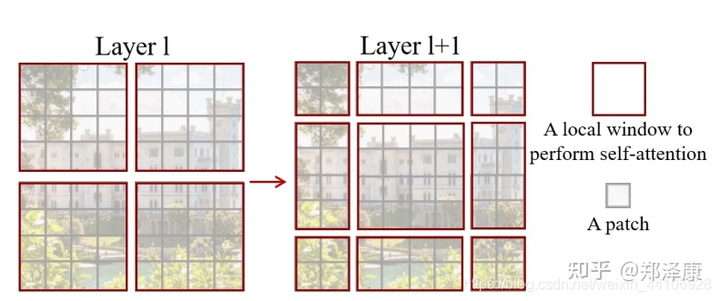

# Swin Transformer

## **从CNNs迈向Transformer**

自从AlexNet在ImageNet上取得重大突破后，CNNs便主导着各个视觉领域的研究，从架构规模、卷积结构等方向持续演进，在深度学习的发展历史中大放异彩，作为基础网络为各式各样的视觉任务提供了强有力的特征抽取和表达，极大地促进了整个视觉领域的繁荣发展。

另一方面在自然语言处理领域也诞生了以Transformer为代表的序列模型架构，利用attention机制为数据的长程依赖性建模大幅度提升了语言模型的性能。在自然语言领域取得的巨大成功让科学家们开始探索Transformer在计算机视觉领域应用的可能性，最近的研究展示了广阔的应用前景。

**拓展Transformer的实用性、使其成为通用的视觉架构是本研究的努力方向**。Transformer在视觉领域的应用挑战相比于自然语言处理主要体现在两方面，其一是图像领域的实体尺度变化剧烈在目标检测任务中尤其如此，而现有transformer架构固定的token尺度无法适应如此大范围变化的目标尺寸；其二是图像的像素分辨率远远高于文本中的单词，像语义分割这样涉及像素级稠密预测的视觉任务，Transformer中自注意力机制会带来非常庞大的计算(像素数的平方复杂度)。

为了克服这些问题，**研究人员提出了一种新的视觉Transformer架构Swin Transformer，在线性计算复杂度的基础上构建了图像的层级特征图**。下图展示了Swin Transformer架构以及与ViT的基本区别。其中Swin Transformer通过小图像Patch和逐层进行邻域合并的方式构建层级特征表达，这样的架构使得模型可以实现与U-Net和FPN等架构类似的稠密预测任务。而这一高效模型的线性计算复杂度则由图中非重叠窗口内的局域自注意力机制实现，由于每层窗口中的Patch固定，所以与图像大小具有线性复杂度关系。而ViT中的特征图大小是固定的，且需要进行(对图像大小)二次复杂度的计算。


**Swin Transformer最为关键的设计在于连续自注意力层间，特征图上的窗划分口实现了半个窗宽的移动**。这使得前一层的窗口间可以实现交互和联系，大幅度提升了模型的表达能力。同时在同一窗口内的查询都拥有相同的key序列，使得硬件内存更容易实现大大提升了模型运行的速度，降低延时。

**这一架构在多种视觉任务上都实现了最先进的性能**，也再一次展示了CV和NLP领域的相互促进，和视觉与-文本信号的融合建模的广阔前景，并为统一框架的提出打下了坚实的基础。下面就让我们一起来分析Swin Transformer的详细结构与实现。

## **整体架构**

我们先看下Swin Transformer的整体架构

**Swin Transformer**

整个模型采取[层次化](https://www.zhihu.com/search?q=层次化&search_source=Entity&hybrid_search_source=Entity&hybrid_search_extra={"sourceType"%3A"article"%2C"sourceId"%3A"367111046"})的设计，一共包含4个Stage，每个stage都会缩小输入[特征图](https://www.zhihu.com/search?q=特征图&search_source=Entity&hybrid_search_source=Entity&hybrid_search_extra={"sourceType"%3A"article"%2C"sourceId"%3A"367111046"})的分辨率，像CNN一样逐层扩大感受野。

- 在输入开始的时候，做了一个`Patch Embedding`，将图片切成一个个图块，并嵌入到`Embedding`。
- 在每个Stage里，由`Patch Merging`和多个Block组成。
- 其中`Patch Merging`模块主要在每个Stage一开始降低图片分辨率。
- 而Block具体结构如右图所示，主要是`LayerNorm`，`MLP`，`Window Attention` 和 `Shifted Window Attention`组成 (为了方便讲解，我会省略掉一些参数)


**Swin Transformer以原始图像Patch像素作为输入，通过编码后得到像素的特征而后逐级传递最终获取图像的特征表达**。在本研究中使用了4x4的Patch作为输入，每个Patch作为一个token，输入的维度为W/4 x H/4 x 48，而后通过一次线性变换得到了W/4 x H/4 x C的特征表达。通过本文提出的Swin Transformer block单元对输入特征进行计算。后续的层一方面将相邻的 2 x 2 Patch 特征进行衔接融合得到 4C 维度的特征，并输入 2C 的融合特征，而另一方面，在水平方向上图像分辨率也变成了 W/8 x H/8，最终生成了 W/8 x H/8 x 4C 的特征。以此类推，随着block的叠加，特征的维度依次变成了W/16 x H/16 x 8C 和 W/32 x H/32 x 16C，与 VGG和ResNet等典型卷积模型的特征图分辨率一致，使其可便捷的成为相关模型的基础架构。

**Swin Transformer中最重要的模块是基于移动窗口构建的注意力模块**，其内部结构如下图所示，包含了一个基于移动窗口的多头自注意力模块(shifted windows multi-head self attention, SW-MSA)和基于窗口的多头自注意力模块(W-MSA)，其他的归一化层和两层的MLP与原来保持一致，并使用了GELU激活函数。


基于移动窗口的W-MSA和基于窗口的SW-MSA模块前后相连，实现不同窗格内特征的传递与交互。基于移动窗口的自注意力模块是本研究的关键所在。

其中有几个地方处理方法与ViT不同：

- ViT在输入会给embedding进行位置编码。而Swin-T这里则是作为一个**可选项**（`self.ape`），Swin-T是在计算Attention的时候做了一个`相对位置编码`
- ViT会单独加上一个可学习参数，作为分类的token。而Swin-T则是**直接做平均**，输出分类，有点类似CNN最后的全局平均池化层

接下来我们看下各个组件的构成.

## **Patch Embedding**

在输入进Block前，我们需要将图片切成一个个patch，然后嵌入向量。

具体做法是对原始图片裁成一个个 `patch_size * patch_size`的窗口大小，然后进行嵌入。

这里可以通过二维卷积层，**将stride，kernel_size设置为 patch_size大小**。设定输出通道来确定嵌入向量的大小。最后将H,W维度展开，并移动到第一维度

```python
import torch
import torch.nn as nn

class PatchEmbed(nn.Module):
    """2D Image to Patch Embedding."""

    def __init__(self,
                 img_size=224,
                 patch_size=4,
                 in_chans=3,
                 embed_dim=96,
                 norm_layer=None,
                 flatten=True):
        super().__init__()

        img_size = to_2tuple(img_size)
        patch_size = to_2tuple(patch_size)

        self.img_size = img_size
        self.patch_size = patch_size
        self.grid_size = (img_size[0] // patch_size[0],
                          img_size[1] // patch_size[1])

        self.num_pathchs = self.grid_size[0] * self.grid_size[1]
        self.flatten = flatten

        self.proj = nn.Conv2d(
            in_channels=in_chans,
            out_channels=embed_dim,
            kernel_size=patch_size,
            stride=patch_size)
        self.norm = norm_layer(embed_dim) if norm_layer else nn.Identity()

    def forward(self, x):
        B, C, H, W = x.shape

        assert H == self.img_size[
            0], f"Input image height ({H}) doesn't match model ({self.img_size[0]})."

        assert W == self.img_size[
            1], f"Input image width ({W}) doesn't match model ({self.img_size[1]})."

        x = self.proj(x)  # trandsform image to patchs
        # 输入 torch.Size([1, 3, 224, 224])
        # 出来的是(N, 96, 224/4, 224/4)
        if self.flatten:
            x = x.flatten(2).transpose(1, 2)  # BCHW -> BNC
        # 把HW维展开，(N, 96, 56*56)
        # 把通道维放到最后 (N, 56*56, 96)
        x = self.norm(x)

        return x
```

## **Patch Merging**

该模块的作用是在每个Stage开始前做降采样，用于缩小分辨率，调整通道数 进而形成层次化的设计，同时也能节省一定运算量。

>  在CNN中，则是在每个Stage开始前用`stride=2`的卷积/[池化层](https://www.zhihu.com/search?q=池化层&search_source=Entity&hybrid_search_source=Entity&hybrid_search_extra={"sourceType"%3A"article"%2C"sourceId"%3A"367111046"})来降低分辨率。
>

每次降采样是两倍，因此**在行方向和列方向上，间隔2选取元素**。

然后拼接在一起作为一整个[张量](https://www.zhihu.com/search?q=张量&search_source=Entity&hybrid_search_source=Entity&hybrid_search_extra={"sourceType"%3A"article"%2C"sourceId"%3A"367111046"})，最后展开。**此时通道维度会变成原先的4倍**（因为H,W各缩小2倍），此时再通过一个全连接层再调整通道维度为原来的两倍

```python
class PatchMerging(nn.Module):
    r""" Patch Merging Layer.

    Args:
        input_resolution (tuple[int]): Resolution of input feature.
        dim (int): Number of input channels.
        norm_layer (nn.Module, optional): Normalization layer.  Default: nn.LayerNorm
    """

    def __init__(self, input_resolution, dim, norm_layer=nn.LayerNorm):
        super().__init__()
        self.input_resolution = input_resolution
        self.dim = dim
        self.reduction = nn.Linear(4 * dim, 2 * dim, bias=False)
        self.norm = norm_layer(4 * dim)

    def forward(self, x):
        """
        x: B, H*W, C
        """
        H, W = self.input_resolution
        B, L, C = x.shape
        _assert(L == H * W, 'input feature has wrong size')
        _assert(H % 2 == 0 and W % 2 == 0, f'x size ({H}*{W}) are not even.')

        x = x.view(B, H, W, C)

        x0 = x[:, 0::2, 0::2, :]  # B H/2 W/2 C
        x1 = x[:, 1::2, 0::2, :]  # B H/2 W/2 C
        x2 = x[:, 0::2, 1::2, :]  # B H/2 W/2 C
        x3 = x[:, 1::2, 1::2, :]  # B H/2 W/2 C
        x = torch.cat([x0, x1, x2, x3], -1)  # B H/2 W/2 4*C
        x = x.view(B, -1, 4 * C)  # B H/2*W/2 4*C

        x = self.norm(x)
        x = self.reduction(x)

        return x
```

```python
import numpy as np
a = np.array(range(10))
[0 1 2 3 4 5 6 7 8 9]
```

```python
print(a[0::2])
[0 2 4 6 8]
```

```python
print(a[1::2])
[1 3 5 7 9]
```

> `a[0::2] `表示取a的从第0个值开始，step = 2, 取第0， 2，4, 6, 8的值。

> `a[:, 1::2]`表示取a的从第1个值开始，step = 2, 取第1， 3，5, 7, 9的值。

> [start :: step] 从start开始，每隔step取值。

下面是一个示意图（输入张量N=1, H=W=8, C=1，不包含最后的全连接层调整）


>  个人感觉这像是PixelShuffle的反操作

## **Window Partition/Reverse**

`window partition`函数是用于对张量划分窗口，指定窗口大小。将原本的张量从 `N H W C`, 划分成 `num_windows*B, window_size, window_size, C`，其中 `num_windows = H*W / window_size`，即窗口的个数。而`window reverse`函数则是对应的[逆过程](https://www.zhihu.com/search?q=逆过程&search_source=Entity&hybrid_search_source=Entity&hybrid_search_extra={"sourceType"%3A"article"%2C"sourceId"%3A"367111046"})。这两个函数会在后面的`Window Attention`用到。

```python
def window_partition(x, window_size: int):
    """
    Args:
        x: (B, H, W, C)
        window_size (int): window size

    Returns:
        windows: (num_windows*B, window_size, window_size, C)
    """
    B, H, W, C = x.shape
    x = x.view(B, H // window_size, window_size, W // window_size, window_size,
               C)
    windows = x.permute(0, 1, 3, 2, 4,
                        5).contiguous().view(-1, window_size, window_size, C)
    return windows


def window_reverse(windows, window_size: int, H: int, W: int):
    """
    Args:
        windows: (num_windows*B, window_size, window_size, C)
        window_size (int): Window size
        H (int): Height of image
        W (int): Width of image

    Returns:
        x: (B, H, W, C)
    """
    B = int(windows.shape[0] / (H * W / window_size / window_size))
    x = windows.view(B, H // window_size, W // window_size, window_size,
                     window_size, -1)
    x = x.permute(0, 1, 3, 2, 4, 5).contiguous().view(B, H, W, -1)
    return x
```

step1:   `B H W C`, 划分成 `num_windows*B, window_size, window_size, C`

step2:   `num_windows*B, window_size, window_size, C`  ===>  `B H W C`,

## **Window Attention**

标准的全局自注意机制需要计算每一个token和其他所有token的相关性，全局计算带来了与token数量二次方的复杂度。这一机制的计算量对于具有大量像素的稠密视觉预测任务十分庞大，很多时候巨大的计算量对于目前的硬件来说不易实现。为了高效的实现这一模型，研究人员提出仅仅在局域窗口内进行自注意力计算，而窗口则来自于对图像的非重叠均匀划分。假设每个窗口中包含M x M个Patch，整张图像共包含h x w个Patch，那么标准的和基于窗口的全局注意力模块的计算复杂度如下：


可以看到标准的全局注意力计算方式与Patch数量的二次关系带来了庞大的计算量，而基于窗格的方式由于M固定则仅仅成线性关系，使得高效计算成为可能。

但这种基于窗格的方式缺乏窗格间的交互，限制了模型的表达能力。为了实现窗格间的交互，研究人员提出了一种在连续特征层间移动窗口的方式来实现。这种机制中，第一个特征图窗格按照正常的方式将8x8的特征图分割成4x4窗格(M=4)。而后在下一层中将窗格整体移动(M/2,M/2)，以此来实现窗格间的交互。

这是这篇文章的关键。传统的Transformer都是**基于全局来计算注意力的**，因此计算复杂度十分高。而Swin Transformer则将**注意力的计算限制在每个窗口内**，进而减少了计算量。

我们先简单看下公式

主要区别是在原始计算Attention的公式中的Q,K时**加入了相对位置编码**。后续实验有证明相对位置编码的加入提升了模型性能。

```python
class WindowAttention(nn.Module):
    r""" Window based multi-head self attention (W-MSA) module with relative position bias.
    It supports both of shifted and non-shifted window.

    Args:
        dim (int): Number of input channels.
        window_size (tuple[int]): The height and width of the window.
        num_heads (int): Number of attention heads.
        qkv_bias (bool, optional):  If True, add a learnable bias to query, key, value. Default: True
        attn_drop (float, optional): Dropout ratio of attention weight. Default: 0.0
        proj_drop (float, optional): Dropout ratio of output. Default: 0.0
    """

    def __init__(self,
                 dim,
                 window_size,
                 num_heads,
                 qkv_bias=True,
                 attn_drop=0.,
                 proj_drop=0.):

        super().__init__()
        self.dim = dim
        self.window_size = window_size  # Wh, Ww
        self.num_heads = num_heads
        head_dim = dim // num_heads
        self.scale = head_dim**-0.5

        # define a parameter table of relative position bias
        self.relative_position_bias_table = nn.Parameter(
            torch.zeros((2 * window_size[0] - 1) * (2 * window_size[1] - 1),
                        num_heads))  # 2*Wh-1 * 2*Ww-1, nH

        # get pair-wise relative position index for each token inside the window
        coords_h = torch.arange(self.window_size[0])
        coords_w = torch.arange(self.window_size[1])
        coords = torch.stack(torch.meshgrid([coords_h, coords_w]))  # 2, Wh, Ww
        coords_flatten = torch.flatten(coords, 1)  # 2, Wh*Ww
        relative_coords = coords_flatten[:, :,
                                         None] - coords_flatten[:,
                                                                None, :]  # 2, Wh*Ww, Wh*Ww
        relative_coords = relative_coords.permute(
            1, 2, 0).contiguous()  # Wh*Ww, Wh*Ww, 2
        relative_coords[:, :,
                        0] += self.window_size[0] - 1  # shift to start from 0
        relative_coords[:, :, 1] += self.window_size[1] - 1
        relative_coords[:, :, 0] *= 2 * self.window_size[1] - 1
        relative_position_index = relative_coords.sum(-1)  # Wh*Ww, Wh*Ww
        self.register_buffer('relative_position_index',
                             relative_position_index)

        self.qkv = nn.Linear(dim, dim * 3, bias=qkv_bias)
        self.attn_drop = nn.Dropout(attn_drop)
        self.proj = nn.Linear(dim, dim)
        self.proj_drop = nn.Dropout(proj_drop)

        trunc_normal_(self.relative_position_bias_table, std=.02)
        self.softmax = nn.Softmax(dim=-1)

    def forward(self, x, mask: Optional[torch.Tensor] = None):
        """
        Args:
            x: input features with shape of (num_windows*B, N, C)
            mask: (0/-inf) mask with shape of (num_windows, Wh*Ww, Wh*Ww) or None
        """
        B_, N, C = x.shape
        qkv = self.qkv(x).reshape(B_, N, 3, self.num_heads,
                                  C // self.num_heads).permute(2, 0, 3, 1, 4)
        q, k, v = qkv.unbind(
            0)  # make torchscript happy (cannot use tensor as tuple)

        q = q * self.scale
        attn = (q @ k.transpose(-2, -1))

        relative_position_bias = self.relative_position_bias_table[
            self.relative_position_index.view(-1)].view(
                self.window_size[0] * self.window_size[1],
                self.window_size[0] * self.window_size[1],
                -1)  # Wh*Ww,Wh*Ww,nH
        relative_position_bias = relative_position_bias.permute(
            2, 0, 1).contiguous()  # nH, Wh*Ww, Wh*Ww
        attn = attn + relative_position_bias.unsqueeze(0)

        if mask is not None:
            nW = mask.shape[0]
            attn = attn.view(B_ // nW, nW, self.num_heads, N,
                             N) + mask.unsqueeze(1).unsqueeze(0)
            attn = attn.view(-1, self.num_heads, N, N)
            attn = self.softmax(attn)
        else:
            attn = self.softmax(attn)

        attn = self.attn_drop(attn)

        x = (attn @ v).transpose(1, 2).reshape(B_, N, C)
        x = self.proj(x)
        x = self.proj_drop(x)
        return x
```

下面我把涉及到相关位置编码的逻辑给单独拿出来，这部分比较绕

首先QK计算出来的Attention张量形状为`(numWindows*B, num_heads, window_size*window_size, window_size*window_size)`。

而对于Attention张量来说，**以不同元素为原点，其他元素的坐标也是不同的**，以`window_size=2`为例，其相对位置编码如下图所示


 首先我们利用`torch.arange`和`torch.meshgrid`函数生成对应的坐标，这里我们以`windowsize=2`为例子

```python
coords_h = torch.arange(self.window_size[0])
coords_w = torch.arange(self.window_size[1])
coords = torch.meshgrid([coords_h, coords_w]) # -> 2*(wh, ww)
"""
  (tensor([[0, 0],
           [1, 1]]),
   tensor([[0, 1],
           [0, 1]]))
"""
```

然后堆叠起来，展开为一个二维向量

```python
coords = torch.stack(coords)  # 2, Wh, Ww
coords_flatten = torch.flatten(coords, 1)  # 2, Wh*Ww
"""
tensor([[0, 0, 1, 1],
        [0, 1, 0, 1]])
"""
```

利用广播机制，分别在第一维，第二维，插入一个维度，进行广播相减，得到 `2, wh*ww, wh*ww`的张量

```python
relative_coords_first = coords_flatten[:, :, None]  # 2, wh*ww, 1
relative_coords_second = coords_flatten[:, None, :] # 2, 1, wh*ww
relative_coords = relative_coords_first - relative_coords_second # 最终得到 2, wh*ww, wh*ww 形状的张量
```

因为采取的是相减，所以得到的索引是从负数开始的，**我们加上偏移量，让其从0开始**。

```python
relative_coords = relative_coords.permute(1, 2, 0).contiguous() # Wh*Ww, Wh*Ww, 2
relative_coords[:, :, 0] += self.window_size[0] - 1
relative_coords[:, :, 1] += self.window_size[1] - 1
```

后续我们需要将其展开成一维偏移量。而对于(1，2）和（2，1）这两个[坐标](https://www.zhihu.com/search?q=坐标&search_source=Entity&hybrid_search_source=Entity&hybrid_search_extra={"sourceType"%3A"article"%2C"sourceId"%3A"367111046"})。在二维上是不同的，**但是通过将x,y坐标相加转换为一维偏移的时候，他的偏移量是相等的**。


 所以最后我们对其中做了个乘法操作，以进行区分

```python
relative_coords[:, :, 0] *= 2 * self.window_size[1] - 1
```


 然后再最后一维上进行求和，展开成一个一维坐标，并注册为一个不参与网络学习的变量

```python
relative_position_index = relative_coords.sum(-1)  # Wh*Ww, Wh*Ww
self.register_buffer("relative_position_index", relative_position_index)
```

接着我们看前向代码

```python
    def forward(self, x, mask: Optional[torch.Tensor] = None):
        """
        Args:
            x: input features with shape of (num_windows*B, N, C)
            mask: (0/-inf) mask with shape of (num_windows, Wh*Ww, Wh*Ww) or None
        """
        B_, N, C = x.shape
        qkv = self.qkv(x).reshape(B_, N, 3, self.num_heads,
                                  C // self.num_heads).permute(2, 0, 3, 1, 4)
        q, k, v = qkv.unbind(
            0)  # make torchscript happy (cannot use tensor as tuple)

        q = q * self.scale
        attn = (q @ k.transpose(-2, -1))

        relative_position_bias = self.relative_position_bias_table[
            self.relative_position_index.view(-1)].view(
                self.window_size[0] * self.window_size[1],
                self.window_size[0] * self.window_size[1],
                -1)  # Wh*Ww,Wh*Ww,nH
        relative_position_bias = relative_position_bias.permute(
            2, 0, 1).contiguous()  # nH, Wh*Ww, Wh*Ww
        attn = attn + relative_position_bias.unsqueeze(0)

        if mask is not None:
            nW = mask.shape[0]
            attn = attn.view(B_ // nW, nW, self.num_heads, N,
                             N) + mask.unsqueeze(1).unsqueeze(0)
            attn = attn.view(-1, self.num_heads, N, N)
            attn = self.softmax(attn)
        else:
            attn = self.softmax(attn)

        attn = self.attn_drop(attn)

        x = (attn @ v).transpose(1, 2).reshape(B_, N, C)
        x = self.proj(x)
        x = self.proj_drop(x)
        return x
```

- 首先输入张量形状为 `numWindows*B, window_size * window_size, C`（后续会解释）

- 然后经过`self.qkv`这个全连接层后，进行reshape，调整轴的顺序，得到形状为`3, numWindows*B, num_heads, window_size*window_size, c//num_heads`，并分配给`q,k,v`。

- 根据公式，我们对`q`乘以一个`scale`缩放系数，然后与`k`（为了满足矩阵乘要求，需要将最后两个维度调换）进行相乘。得到形状为`(numWindows*B, num_heads, window_size*window_size, window_size*window_size)`的`attn`张量

- 之前我们针对位置编码设置了个形状为`(2*window_size-1*2*window_size-1, numHeads)`的可学习变量。我们用计算得到的相对编码位置索引`self.relative_position_index`选取，得到形状为`(window_size*window_size, window_size*window_size, numHeads)`的编码，加到`attn`张量上

- 暂不考虑mask的情况，剩下就是跟transformer一样的softmax，dropout，与`V`[矩阵](https://www.zhihu.com/search?q=矩阵&search_source=Entity&hybrid_search_source=Entity&hybrid_search_extra={"sourceType"%3A"article"%2C"sourceId"%3A"367111046"})乘，再经过一层全连接层和dropout


## **Shifted Window Attention**

前面的Window Attention是在每个窗口下计算注意力的，为了更好的和其他window进行信息交互，Swin Transformer还引入了shifted window操作。



 左边是没有重叠的Window Attention，而右边则是将窗口进行移位的Shift Window Attention。可以看到移位后的窗口包含了原本相邻窗口的元素。但这也引入了一个新问题，即**window的个数翻倍了**，由原本四个窗口变成了9个窗口。

在实际代码里，我们是**通过对特征图移位，并给Attention设置mask来间接实现的**。能在**保持原有的window个数下**，最后的计算结果等价。


## **特征图移位操作**

代码里对特征图移位是通过`torch.roll`来实现的，下面是示意图


>  如果需要`reverse cyclic shift`的话只需把参数`shifts`设置为对应的正数值。
>

## **Attention Mask**

我认为这是Swin Transformer的精华，通过设置合理的mask，让`Shifted Window Attention`在与`Window Attention`相同的窗口个数下，达到等价的计算结果。

首先我们对Shift Window后的每个窗口都给上index，并且做一个`roll`操作（window_size=2, shift_size=-1）


 我们希望在计算Attention的时候，**让具有相同index QK进行计算，而忽略不同index QK计算结果**。

最后正确的结果如下图所示


 而要想在原始四个窗口下得到正确的结果，我们就必须给Attention的结果加入一个mask（如上图最右边所示）

相关代码如下：

```python
        if self.shift_size > 0:
            # calculate attention mask for SW-MSA
            H, W = self.input_resolution
            img_mask = torch.zeros((1, H, W, 1))  # 1 H W 1
            h_slices = (slice(0, -self.window_size),
                        slice(-self.window_size,
                              -self.shift_size), slice(-self.shift_size, None))
            w_slices = (slice(0, -self.window_size),
                        slice(-self.window_size,
                              -self.shift_size), slice(-self.shift_size, None))
            cnt = 0
            for h in h_slices:
                for w in w_slices:
                    img_mask[:, h, w, :] = cnt
                    cnt += 1

            mask_windows = window_partition(
                img_mask, self.window_size)  # nW, window_size, window_size, 1
            mask_windows = mask_windows.view(
                -1, self.window_size * self.window_size)
            attn_mask = mask_windows.unsqueeze(1) - mask_windows.unsqueeze(2)
            attn_mask = attn_mask.masked_fill(attn_mask != 0,
                                              float(-100.0)).masked_fill(
                                                  attn_mask == 0, float(0.0))
        else:
            attn_mask = None
```

以上图的设置，我们用这段代码会得到这样的一个mask

```python
tensor([[[[[   0.,    0.,    0.,    0.],
           [   0.,    0.,    0.,    0.],
           [   0.,    0.,    0.,    0.],
           [   0.,    0.,    0.,    0.]]],


         [[[   0., -100.,    0., -100.],
           [-100.,    0., -100.,    0.],
           [   0., -100.,    0., -100.],
           [-100.,    0., -100.,    0.]]],


         [[[   0.,    0., -100., -100.],
           [   0.,    0., -100., -100.],
           [-100., -100.,    0.,    0.],
           [-100., -100.,    0.,    0.]]],


         [[[   0., -100., -100., -100.],
           [-100.,    0., -100., -100.],
           [-100., -100.,    0., -100.],
           [-100., -100., -100.,    0.]]]]])
```

在之前的window attention模块的前向代码里，包含这么一段

```python
        if mask is not None:
            nW = mask.shape[0]
            attn = attn.view(B_ // nW, nW, self.num_heads, N,
                             N) + mask.unsqueeze(1).unsqueeze(0)
            attn = attn.view(-1, self.num_heads, N, N)
            attn = self.softmax(attn)
        else:
            attn = self.softmax(attn)
```

将mask加到attention的计算结果，并进行softmax。mask的值设置为-100，softmax后就会忽略掉对应的值

## **Transformer Block整体架构**


 两个连续的Block架构如上图所示，需要注意的是一个Stage包含的Block个数必须是偶数，因为需要交替包含一个含有`Window Attention`的Layer和含有`Shifted Window Attention`的Layer。

我们看下Block的前向代码

```python
class SwinTransformerBlock(nn.Module):
    r""" Swin Transformer Block.

    Args:
        dim (int): Number of input channels.
        input_resolution (tuple[int]): Input resulotion.
        num_heads (int): Number of attention heads.
        window_size (int): Window size.
        shift_size (int): Shift size for SW-MSA.
        mlp_ratio (float): Ratio of mlp hidden dim to embedding dim.
        qkv_bias (bool, optional): If True, add a learnable bias to query, key, value. Default: True
        drop (float, optional): Dropout rate. Default: 0.0
        attn_drop (float, optional): Attention dropout rate. Default: 0.0
        drop_path (float, optional): Stochastic depth rate. Default: 0.0
        act_layer (nn.Module, optional): Activation layer. Default: nn.GELU
        norm_layer (nn.Module, optional): Normalization layer.  Default: nn.LayerNorm
    """

    def __init__(self,
                 dim,
                 input_resolution,
                 num_heads,
                 window_size=7,
                 shift_size=0,
                 mlp_ratio=4.,
                 qkv_bias=True,
                 drop=0.,
                 attn_drop=0.,
                 drop_path=0.,
                 act_layer=nn.GELU,
                 norm_layer=nn.LayerNorm):
        super().__init__()
        self.dim = dim
        self.input_resolution = input_resolution
        self.num_heads = num_heads
        self.window_size = window_size
        self.shift_size = shift_size
        self.mlp_ratio = mlp_ratio
        if min(self.input_resolution) <= self.window_size:
            # if window size is larger than input resolution, we don't partition windows
            self.shift_size = 0
            self.window_size = min(self.input_resolution)
        assert 0 <= self.shift_size < self.window_size, 'shift_size must in 0-window_size'

        self.norm1 = norm_layer(dim)
        self.attn = WindowAttention(
            dim,
            window_size=to_2tuple(self.window_size),
            num_heads=num_heads,
            qkv_bias=qkv_bias,
            attn_drop=attn_drop,
            proj_drop=drop)

        self.drop_path = DropPath(
            drop_path) if drop_path > 0. else nn.Identity()
        self.norm2 = norm_layer(dim)
        mlp_hidden_dim = int(dim * mlp_ratio)
        self.mlp = Mlp(
            in_features=dim,
            hidden_features=mlp_hidden_dim,
            act_layer=act_layer,
            drop=drop)

        if self.shift_size > 0:
            # calculate attention mask for SW-MSA
            H, W = self.input_resolution
            img_mask = torch.zeros((1, H, W, 1))  # 1 H W 1
            h_slices = (slice(0, -self.window_size),
                        slice(-self.window_size,
                              -self.shift_size), slice(-self.shift_size, None))
            w_slices = (slice(0, -self.window_size),
                        slice(-self.window_size,
                              -self.shift_size), slice(-self.shift_size, None))
            cnt = 0
            for h in h_slices:
                for w in w_slices:
                    img_mask[:, h, w, :] = cnt
                    cnt += 1

            mask_windows = window_partition(
                img_mask, self.window_size)  # nW, window_size, window_size, 1
            mask_windows = mask_windows.view(
                -1, self.window_size * self.window_size)
            attn_mask = mask_windows.unsqueeze(1) - mask_windows.unsqueeze(2)
            attn_mask = attn_mask.masked_fill(attn_mask != 0,
                                              float(-100.0)).masked_fill(
                                                  attn_mask == 0, float(0.0))
        else:
            attn_mask = None

        self.register_buffer('attn_mask', attn_mask)

    def forward(self, x):
        H, W = self.input_resolution
        B, L, C = x.shape
        _assert(L == H * W, 'input feature has wrong size')

        shortcut = x
        x = self.norm1(x)
        x = x.view(B, H, W, C)

        # cyclic shift
        if self.shift_size > 0:
            shifted_x = torch.roll(
                x, shifts=(-self.shift_size, -self.shift_size), dims=(1, 2))
        else:
            shifted_x = x

        # partition windows
        x_windows = window_partition(
            shifted_x, self.window_size)  # nW*B, window_size, window_size, C
        x_windows = x_windows.view(-1, self.window_size * self.window_size,
                                   C)  # nW*B, window_size*window_size, C

        # W-MSA/SW-MSA
        attn_windows = self.attn(
            x_windows, mask=self.attn_mask)  # nW*B, window_size*window_size, C

        # merge windows
        attn_windows = attn_windows.view(-1, self.window_size,
                                         self.window_size, C)
        shifted_x = window_reverse(attn_windows, self.window_size, H,
                                   W)  # B H' W' C

        # reverse cyclic shift
        if self.shift_size > 0:
            x = torch.roll(
                shifted_x,
                shifts=(self.shift_size, self.shift_size),
                dims=(1, 2))
        else:
            x = shifted_x
        x = x.view(B, H * W, C)

        # FFN
        x = shortcut + self.drop_path(x)
        x = x + self.drop_path(self.mlp(self.norm2(x)))

        return x
```

整体流程如下

- 先对特征图进行LayerNorm
- 通过`self.shift_size`决定是否需要对特征图进行shift
- 然后将特征图切成一个个窗口
- 计算Attention，通过`self.attn_mask`来区分`Window Attention`还是`Shift Window Attention`
- 将各个窗口合并回来
- 如果之前有做shift操作，此时进行`reverse shift`，把之前的shift操作恢复
- 做dropout和残差连接
- 再通过一层LayerNorm+全连接层，以及dropout和残差连接

## **实验结果**


 在ImageNet22K数据集上，准确率能达到惊人的86.4%。另外在检测，分割等任务上表现也很优异，感兴趣的可以翻看论文最后的实验部分。


## 作者胡瀚回答

### Q1 论文试图解决什么问题？

论文试图提出一种新的基于Transformer的视觉骨干网络（几乎所有计算机视觉任务均需要的基本图像特征提取步骤），希望这一骨干网络能真正超越此前主流的卷积神经网络，成为视觉骨干网络的新主流，从而能和自然语言处理（Transformer是该领域主流骨干网络）有统一的建模。

### Q2 这是否是一个新的问题？

不是一个新问题。无需卷积，基于Transformer中自注意模块搭建的视觉骨干网络两年前即有研究（以同期的Swin原作者团队做的Local Relation Networks和Transformer原作者团队所做的SASA为相关先驱工作），但是这些工作由于硬件实现不太友好，没有得到主流的关注。最近谷歌的ViT模型，在图像分类上取得了很好的效果，而且运行速度较快，但是不适合于其他密集识别任务。

###  Q3 这篇文章要验证一个什么科学假设？

1、Transformer有可能取代传统的卷积网络，成为计算机视觉的新骨干网络；2、由于图像和文本特点的不同，将层次性、局部性和平移不变性等先验引入Transformer网络结构设计能帮助在视觉任务中取得更好的性能。

Q4 有哪些相关研究？如何归类？谁是这一课题在领域内值得关注的研究员？

1、此前主流的视觉骨干网络是基于卷积的网络，由于其基本性，它们的进展很大程度推动了视觉整体的发展。经典的骨干网络包括：AlexNet, GoogleNet, VGGNet, ResNet, DenseNet等等；

2、基于自注意模块（Transformer的基本单元）的视觉骨干网络。先驱的工作包括本文原作者团队做的Local Relation Networks（ICCV19）和Transformer原作者团队所做的SASA (NeurIPS2019)；

3、将注意力模块应用于各种视觉问题，与卷积形成互补。本文原作者团队做了一系列相关工作，广泛应用于图像分类、物体检测、语义分割等重要的视觉问题。其它较有影响力的工作包括Facebook何恺明团队的NL-Net以及Facebook的DETR检测器；

4、基于Transfomer整体网络结构的视觉骨干网络。先驱工作是谷歌的ViT网络，利用海量数据在图像分类上取得了很好的性能。此后Facebook的DeiT在中等规模数据上证明了ViT网络的有效性。

###  Q5 论文中提到的解决方案之关键是什么？

解决方案：将层次性、局部性和平移不变性等先验引入Transformer网络结构设计。 核心创新：移位窗口（shifted window）设计：

 1）自注意的计算在局部的非重叠窗口内进行。这一设计有两方面的好处，一是复杂度从此前的和图像大小的平方关系变成了线性关系，也使得层次化的整体结构设计、局部先验的引入成为可能，

二是因为采用非重叠窗口，自注意计算时不同query会共享同样的key集合，从而对硬件友好，更实用。 

2）在前后两层的Transformer模块中，非重叠窗口的配置相比前一层做了半个窗口的移位，这样使得上一层中不同窗口的信息进行了交换。 相比于卷积网络以及先驱的自注意骨干网络（Local Relation Net和SASA）中常见的滑动窗（Sliding window）设计，这一新的设计牺牲了部分平移不变性，但是实验发现平移不变性的部分丢失不会降低准确率，甚至以为正则效应效果更好。同时，这一设计对硬件更友好，从而更实用而有希望成为主流。

Q6 论文中的实验是如何设计的？

在三个最典型的视觉任务：图像分类、检测和分割中，替换以前的骨干网络，考察在相同计算代价和复杂度情况下，性能是否有增益。设计了三个层次的实验：1、系统级和state-of-the-art比较；2、骨干网络级比较。骨干网络是否对于各种主流框架都有用？3、消融实验验证核心设计的有效性。

###  Q7 用于定量评估的数据集是什么？代码有没有开源？

三个任务分别采用最主流的评测集ImageNet-1K，COCO和ADE20K。代码进行了开源， https://github.com/microsoft/Swin-Transformer(4.5k star) https://github.com/SwinTransformer(总和1.8k star)。(截至2021.9.28)

###  Q8 论文中的实验及结果有没有很好地支持需要验证的科学假设？

论文设计了三个层次的实验来验证有效性：

1、系统级和state-of-the-art比较。在COCO物体检测和ADE20K语义分割评测集上，分别比此前最好的方法显著高出2.7个点（mAP）和3.5个点（mIoU）；

2、骨干网络级比较。主要做了物体检测的实验，在4种主流物体检测器和不同模型大小情况下，只替换骨干网络，比相同复杂度的CNN网络高出3.5-4.5个点。ADE20K语义分割上，相比于此前的骨干网络，也普遍有3-5个点的提升；

3、核心设计有效性的验证，包括移位窗口设计，相对位置先验项的重要性，与滑动窗口和其它稀疏自注意算法的比较。分别在三个任务上验证了有效性。

###  Q9 这篇论文到底有什么贡献？

1、认知贡献。此前谷歌的ViT引起了一些关注，但学界和业界普遍认为Transformer骨干网络还有很远的路要走才能替代卷积网络成为主流。这一工作通过证明Transformer可以在重要的物体检测（区域级别识别任务）和语义分割（像素级别识别任务）评测集上相比此前所有的卷积网络方法取得显著提升，来让学界和业界意识到Transformer模型将会取代卷积网络，成为视觉骨干网络的新主流。 

2、工程贡献。这一工作中的诸多设计有望长期成为视觉领域的默认做法，包括移位窗口的设计，相对位置偏置项，和此前完全不一样的训练recipe等等。

###  Q10 下一步呢？有什么工作可以继续深入？

移位窗口的设计对NLP是否同样适用？ Transformer能否scale up？ Transformer如何使CV和NLP有机结合起来？ Transformer能将视觉推向一个什么样的高度？

