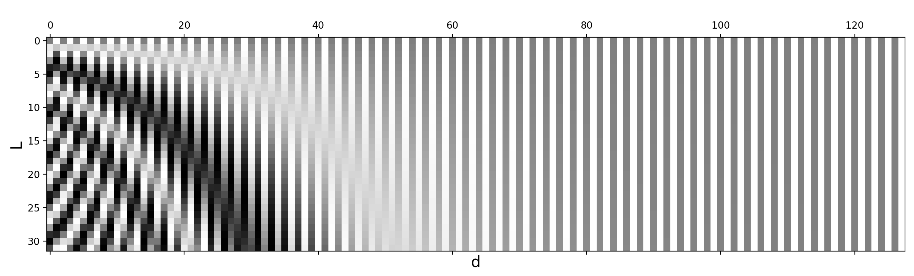

## Transformer

[“Attention is All you Need”](http://papers.nips.cc/paper/7181-attention-is-all-you-need.pdf) (Vaswani, et al., 2017), without a doubt, is one of the most impactful and interesting paper in 2017. It presented a lot of improvements to the soft attention and make it possible to do seq2seq modeling *without* recurrent network units. The proposed “**transformer**” model is entirely built on the self-attention mechanisms without using sequence-aligned recurrent architecture.

The secret recipe is carried in its model architecture.

### Key, Value and Query

The major component in the transformer is the unit of *multi-head self-attention mechanism*. The transformer views the encoded representation of the input as a set of **key**-**value** pairs, $(K,V)$, both of dimension nn (input sequence length); in the context of NMT, both the keys and values are the encoder hidden states. In the decoder, the previous output is compressed into a **query** (QQ of dimension mm) and the next output is produced by mapping this query and the set of keys and values.

The transformer adopts the [scaled dot-product attention](https://lilianweng.github.io/lil-log/2018/06/24/attention-attention.html#summary): the output is a weighted sum of the values, where the weight assigned to each value is determined by the dot-product of the query with all the keys:
$$
\text{Attention}(\mathbf{Q}, \mathbf{K}, \mathbf{V}) = \text{softmax}(\frac{\mathbf{Q}\mathbf{K}^\top}{\sqrt{n}})\mathbf{V}
$$

### Multi-Head Self-Attention

*Fig. 14. Multi-head scaled dot-product attention mechanism. (Image source: Fig 2 in [Vaswani, et al., 2017](http://papers.nips.cc/paper/7181-attention-is-all-you-need.pdf))*

Rather than only computing the attention once, the multi-head mechanism runs through the scaled dot-product attention multiple times in parallel. The independent attention outputs are simply concatenated and linearly transformed into the expected dimensions. I assume the motivation is because ensembling always helps? ;) According to the paper, *“multi-head attention allows the model to jointly attend to information from different representation **subspaces** at different positions. With a single attention head, averaging inhibits this.”*
$$
\begin{aligned}
\text{MultiHead}(\mathbf{Q}, \mathbf{K}, \mathbf{V}) &= [\text{head}_1; \dots; \text{head}_h]\mathbf{W}^O \\
\text{where head}_i &= \text{Attention}(\mathbf{Q}\mathbf{W}^Q_i, \mathbf{K}\mathbf{W}^K_i, \mathbf{V}\mathbf{W}^V_i)
\end{aligned}
$$
where $W^Q_i$, $W^K_i$, $W^V_i$, and $W^O_i$ are parameter matrices to be learned.

### Encoder

*Fig. 15. The transformer’s encoder. (Image source: [Vaswani, et al., 2017](http://papers.nips.cc/paper/7181-attention-is-all-you-need.pdf))*

The encoder generates an attention-based representation with capability to locate a specific piece of information from a potentially infinitely-large context.

- A stack of N=6 identical layers.
- Each layer has a **multi-head self-attention layer** and a simple position-wise **fully connected feed-forward network**.
- Each sub-layer adopts a [**residual**](https://arxiv.org/pdf/1512.03385.pdf) connection and a layer **normalization**. All the sub-layers output data of the same dimension dmodel=512dmodel=512.

### Decoder

*Fig. 16. The transformer’s decoder. (Image source: [Vaswani, et al., 2017](http://papers.nips.cc/paper/7181-attention-is-all-you-need.pdf))*

The decoder is able to retrieval from the encoded representation.

- A stack of N = 6 identical layers
- Each layer has two sub-layers of multi-head attention mechanisms and one sub-layer of fully-connected feed-forward network.
- Similar to the encoder, each sub-layer adopts a residual connection and a layer normalization.
- The first multi-head attention sub-layer is **modified** to prevent positions from attending to subsequent positions, as we don’t want to look into the future of the target sequence when predicting the current position.

### Full Architecture

Finally here is the complete view of the transformer’s architecture:

- Both the source and target sequences first go through embedding layers to produce data of the same dimension dmodel=512dmodel=512.
- To preserve the position information, a sinusoid-wave-based positional encoding is applied and summed with the embedding output.
- A softmax and linear layer are added to the final decoder output.

*Fig. 17. The full model architecture of the transformer. (Image source: Fig 1 & 2 in [Vaswani, et al., 2017](http://papers.nips.cc/paper/7181-attention-is-all-you-need.pdf).)*

### **Positional Encoding**

Because self-attention operation is permutation invariant, it is important to use proper **positional encoding** to provide *order information* to the model. The positional encoding  $ P∈R^{L×d}$ has the same dimension as the input embedding, so it can be added on the input directly. The vanilla Transformer considered two types of encodings:

(1) *Sinusoidal positional encoding* is defined as follows, given the token position $i=1,…,L$ and the dimension $δ=1,…,d$:
$$
\text{PE}(i,\delta) = 
\begin{cases}
\sin(\frac{i}{10000^{2\delta'/d}}) & \text{if } \delta = 2\delta'\\
\cos(\frac{i}{10000^{2\delta'/d}}) & \text{if } \delta = 2\delta' + 1\\
\end{cases}
$$

In this way each dimension of the positional encoding corresponds to a sinusoid of different wavelengths in different dimensions, from $2π$ to $10000⋅2π$.

*Fig. 3. Sinusoidal positional encoding with $L=32$ and $d=128$. The value is between -1 (black) and 1 (white) and the value 0 is in gray.*

(2) *Learned positional encoding*, as its name suggested, assigns each element with a learned column vector which encodes its *absolute* position ([Gehring, et al. 2017](https://arxiv.org/abs/1705.03122)).

